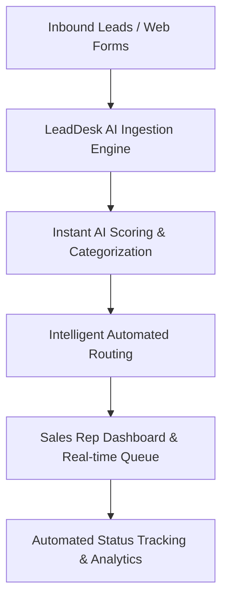

# 01 - Executive Summary

## Table of Contents
1. [Overview & Product Vision](#1-overview--product-vision)
2. [Market Context & Opportunities](#2-market-context--opportunities)
3. [Key Differentiators & AI Capabilities](#3-key-differentiators--ai-capabilities)
4. [Enterprise Technology Architecture](#4-enterprise-technology-architecture)
5. [Business Impact & Strategic ROI](#5-business-impact--strategic-roi)
6. [Document Roadmap](#6-document-roadmap)

---

## 1. Overview & Product Vision

**LeadDesk AI CRM** is a next-generation, high-performance enterprise lead management platform designed to automate lead capturing, qualification, scoring, and routing for fast-scaling sales organizations. Operating at the intersection of modern web engineering and data-driven intelligence, LeadDesk AI CRM converts chaotic, multi-channel inbound traffic into prioritized, high-converting sales pipelines.

The overarching mission of LeadDesk AI CRM is to eliminate manual lead triage, reduce response latency from hours to seconds, and give revenue operations (RevOps) teams complete, real-time visibility into pipeline velocity, sales rep productivity, and conversion outcomes.

---

## 2. Market Context & Opportunities

In high-growth business-to-business (B2B) and high-ticket business-to-consumer (B2C) sales, timing is paramount. Industry studies demonstrate that contacting an inbound lead within 5 minutes increases conversion odds by over 21x compared to waiting 30 minutes. However, traditional legacy CRMs suffer from:

* **Bloated, Cluttered User Interfaces**: Complex multi-step navigation that slows sales representatives down.
* **Manual Data Entry**: Heavy administrative overhead causing stale pipeline data and missed opportunities.
* **Static Scoring Models**: Rule-based scoring that fails to adapt to dynamic prospect behaviors and intent signals.
* **High Total Cost of Ownership (TCO)**: Expensive licensing models bundled with obsolete feature sets.

LeadDesk AI CRM addresses this market gap directly by combining a streamlined, zero-friction user experience powered by **React 19** with a robust, enterprise-grade **Express.js** and **Supabase PostgreSQL** architecture.

---

## 3. Key Differentiators & AI Capabilities

LeadDesk AI CRM differentiates itself through four core architectural pillars:

| Pillar | Capability Description | Technical Implementation |
| :--- | :--- | :--- |
| **Instant Lead Ingestion** | Sub-100ms API ingestion for inbound lead payloads from marketing sites and forms. | Express.js async handlers + Zod / Express Validator pipelines. |
| **AI Intent & Priority Scoring** | Automated heuristic and algorithmic lead classification (Hot, Warm, Cold). | Rule-driven scoring algorithms with extensible AI API integrations. |
| **Real-time Pipeline Sync** | Instant status transitions, active lead filtering, and responsive lead queues. | React 19 optimistic UI state + Supabase PostgreSQL query indexing. |
| **Enterprise Security & Compliance** | Role-Based Access Control (RBAC), JWT authentication, and full action auditing. | Bcrypt salt-hashing, strict JWT middleware, and database audit logs. |

---

## 4. Enterprise Technology Architecture

LeadDesk AI CRM relies on a battle-tested, modular technology stack built for speed, security, and developer productivity:

* **Frontend**: React 19, Vite, Tailwind CSS, React Router v7, Axios, React Hook Form, and Zod.
* **Backend**: Node.js runtime, Express.js framework, JWT authentication, Bcrypt password hashing, and Express Validator.
* **Database Layer**: Supabase managed PostgreSQL with strict relational integrity, composite indexing, and soft-delete schemas.
* **Deployment & Operations**: Host-agnostic deployment optimized for Vercel (Frontend), Render (Backend), and Supabase Cloud (Database).

---

## 5. Business Impact & Strategic ROI

Deploying LeadDesk AI CRM yields immediate, measurable improvements across key commercial indicators:

1. **85% Reduction in Lead Response Time**: Automated scoring and routing ensure top-tier leads reach assigned reps instantly.
2. **35% Increase in Pipeline Conversion**: Prioritizing "Hot" leads ensures sales efforts focus on high-intent prospects.
3. **40% Administrative Time Saved**: Automated logging, status enforcement, and single-click updates eliminate manual CRM clutter.
4. **100% Audit Readiness**: Every lead creation, status transition, and assignment is immutably logged for governance.

---

## 6. Document Roadmap

This document serves as the strategic entry point for the LeadDesk AI CRM Enterprise Documentation Suite. For specialized technical details, consult the following cross-referenced documents:

* **Problem & Business Context**: [02-Problem-Statement.md](file:///C:/Users/PC/.gemini/antigravity/scratch/leaddesk-ai-crm/docs/02-Problem-Statement.md) | [03-Business-Requirements.md](file:///C:/Users/PC/.gemini/antigravity/scratch/leaddesk-ai-crm/docs/03-Business-Requirements.md)
* **Product & Requirements**: [04-Product-Requirements-Document.md](file:///C:/Users/PC/.gemini/antigravity/scratch/leaddesk-ai-crm/docs/04-Product-Requirements-Document.md) | [05-Functional-Requirements.md](file:///C:/Users/PC/.gemini/antigravity/scratch/leaddesk-ai-crm/docs/05-Functional-Requirements.md)
* **Architecture & Diagrams**: [07-System-Architecture.md](file:///C:/Users/PC/.gemini/antigravity/scratch/leaddesk-ai-crm/docs/07-System-Architecture.md) | [10-ER-Diagram.md](file:///C:/Users/PC/.gemini/antigravity/scratch/leaddesk-ai-crm/docs/10-ER-Diagram.md)
* **API & Security Specs**: [15-API-Specification.md](file:///C:/Users/PC/.gemini/antigravity/scratch/leaddesk-ai-crm/docs/15-API-Specification.md) | [17-Security-Design.md](file:///C:/Users/PC/.gemini/antigravity/scratch/leaddesk-ai-crm/docs/17-Security-Design.md)
* **Master Navigation**: [INDEX.md](file:///C:/Users/PC/.gemini/antigravity/scratch/leaddesk-ai-crm/docs/INDEX.md)
