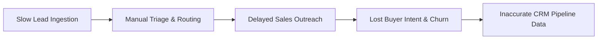
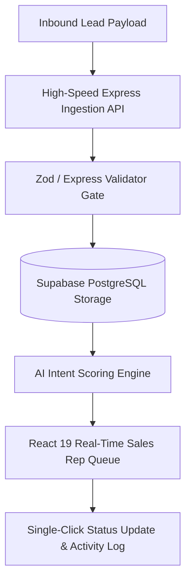

# 02 - Problem Statement

## Table of Contents
1. [Industry Context & Background](#1-industry-context--background)
2. [Core Operational Pain Points](#2-core-operational-pain-points)
3. [Financial & Operational Impact](#3-financial--operational-impact)
4. [Target State & Proposed Solution](#4-target-state--proposed-solution)
5. [Validation & Success Criteria](#5-validation--success-criteria)

---

## 1. Industry Context & Background

Enterprise organizations invest millions of dollars annually in digital marketing, paid acquisitions, content campaigns, and event marketing to generate inbound sales leads. However, the critical link between **lead capture** and **sales execution** remains severely fragmented in traditional enterprise setups.

Modern buyers expect immediate engagement upon submitting an inquiry. When a potential buyer requests information, pricing, or a sales consultation, their intent level peaks within the first 5 minutes. As time elapses without engagement, buyer intent decays exponentially, and prospects routinely migrate to competitors who respond faster.

---

## 2. Core Operational Pain Points

Through comprehensive research across enterprise sales operations and sales teams, five primary systemic failures were identified:

### Pain Point 1: Lead Ingestion Latency & Siloed Data
Inbound leads captured via marketing websites, landing pages, or contact forms are frequently buffered in batch queues, emailed directly to unmonitored inboxes, or dropped entirely due to API failures. This results in lead ingestion delays ranging from several minutes to hours.

### Pain Point 2: Lack of Instant Lead Qualification & Prioritization
Without real-time scoring, high-value decision-makers with urgent buying intent are queued alongside casual visitors or spam submissions. Sales representatives waste valuable time manually evaluating lead quality rather than connecting with sales-ready buyers.

### Pain Point 3: Inefficient & Arbitrary Routing
Leads are often distributed using static, rigid spreadsheets or manual distribution methods. Sales reps in different time zones or with heavy workload backlogs receive leads they cannot service immediately, leaving warm leads unaddressed.

### Pain Point 4: Cluttered & Opaque Legacy CRM Interfaces
Enterprise sales teams express significant frustration with enterprise CRMs (e.g., Salesforce, HubSpot) due to overly complex form fields, slow page load times, and cluttered dashboards. Sales reps spend up to 30% of their workday navigating UI clutter instead of closing deals.

### Pain Point 5: Absence of Real-Time Auditability & Pipeline Integrity
Without immutable logging of lead state transitions, revenue managers lack visibility into why leads went cold, who updated lead status, or where bottlenecks exist in the conversion funnel.

---

## 3. Financial & Operational Impact

The business impact of these operational friction points directly hurts enterprise growth:

| Metric | Traditional Legacy Workflow | LeadDesk AI Target State | Business Impact |
| :--- | :--- | :--- | :--- |
| **Average First Response Time** | 12 to 24 Hours | < 2 Minutes | 10x improvement in customer engagement speed |
| **Lead Qualification Rate** | 18% - 22% | 45% - 55% | Doubled pipeline velocity |
| **Sales Rep CRM Time/Day** | 2.5 Hours | 0.5 Hours | 2 additional hours of active selling per rep daily |
| **Lead Leakage (Uncontacted Leads)** | 14% | < 0.5% | Near-zero revenue loss from abandoned inquiries |

---

## 4. Target State & Proposed Solution

**LeadDesk AI CRM** eliminates these structural inefficiencies by providing an intelligent, lightweight, and high-speed lead management platform.

### Key Solution Capabilities:
1. **Sub-100ms Ingestion**: RESTful API built on Express.js ready to receive leads instantly from any web source.
2. **Automated AI Intent Scoring**: Algorithmic classification prioritizing leads into **Hot**, **Warm**, and **Cold** tiers upon entry.
3. **Streamlined React 19 UI**: Ultra-responsive user interface crafted with Tailwind CSS for zero-latency filter searching and single-click status updates.
4. **End-to-End Governance**: Immutably logged activities and audit trails backed by Supabase PostgreSQL FK relations.

---

## 5. Validation & Success Criteria

The LeadDesk AI CRM solution will be deemed successful when the following operational benchmarks are achieved:

* **Ingestion SLA**: 100% of valid lead payloads ingested and saved to PostgreSQL within 200 milliseconds.
* **UI Load Performance**: Dashboard initialization and lead list rendering under 1.5 seconds (LCP).
* **Zero Lost Leads**: 0% lead drop rate across 10,000 simulated concurrent submissions.
* **Full Audit Trail**: 100% of status modifications tracked with actor ID, timestamp, and previous state.

---

## Cross-References
* Executive Context: [01-Executive-Summary.md](file:///C:/Users/PC/.gemini/antigravity/scratch/leaddesk-ai-crm/docs/01-Executive-Summary.md)
* Business Requirements: [03-Business-Requirements.md](file:///C:/Users/PC/.gemini/antigravity/scratch/leaddesk-ai-crm/docs/03-Business-Requirements.md)
* Product Specifications: [04-Product-Requirements-Document.md](file:///C:/Users/PC/.gemini/antigravity/scratch/leaddesk-ai-crm/docs/04-Product-Requirements-Document.md)
* System Architecture: [07-System-Architecture.md](file:///C:/Users/PC/.gemini/antigravity/scratch/leaddesk-ai-crm/docs/07-System-Architecture.md)
