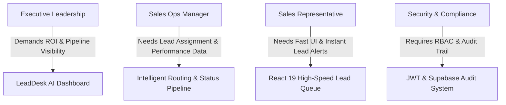
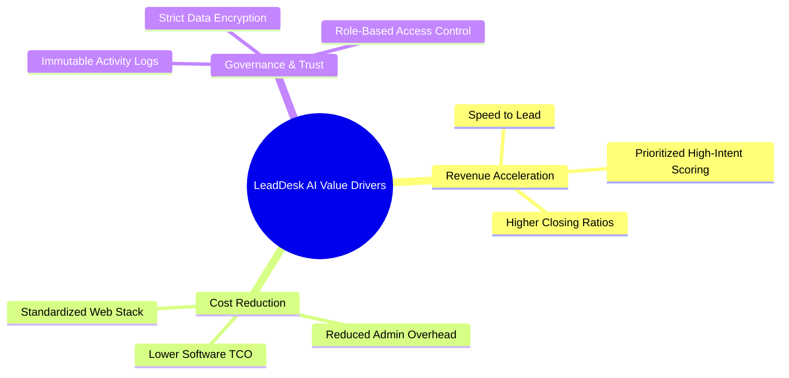

# 03 - Business Requirements

## Table of Contents
1. [Business Goals & Objectives](#1-business-goals--objectives)
2. [Stakeholder Analysis Matrix](#2-stakeholder-analysis-matrix)
3. [Core Business Drivers & Value Creation](#3-core-business-drivers--value-creation)
4. [Compliance, Governance & Data Sovereignty](#4-compliance-governance--data-sovereignty)
5. [Operational Risk Management](#5-operational-risk-management)
6. [Business KPI Framework](#6-business-kpi-framework)

---

## 1. Business Goals & Objectives

The primary objective of **LeadDesk AI CRM** is to provide enterprise sales organizations with an intelligent, centralized, and highly secure lead processing pipeline that maximizes conversion revenue while minimizing operational expenditure.

### Strategic Objectives:
* **BG-01: Response Acceleration**: Reduce average inbound lead response time from 12+ hours to under 2 minutes.
* **BG-02: Pipeline Optimization**: Increase high-intent lead-to-opportunity conversion rate by at least 30%.
* **BG-03: Operational Efficiency**: Eliminate manual CRM admin work, saving sales reps an estimated 10 hours per month.
* **BG-04: Scalable Infrastructure**: Maintain sub-200ms API response times at throughput levels exceeding 100,000 lead submissions per day.
* **BG-05: Strict Data Compliance**: Ensure 100% compliance with international privacy mandates (GDPR, CCPA) through robust access control and audit logging.

---

## 2. Stakeholder Analysis Matrix

Understanding stakeholder requirements is vital for enterprise system adoption. The matrix below defines key organizational roles, their core concerns, and system capabilities addressing those needs:

| Stakeholder Role | Key Goals & Expectations | Primary Pain Point | LeadDesk AI Solution |
| :--- | :--- | :--- | :--- |
| **Chief Revenue Officer (CRO)** | Predictable revenue growth, sales pipeline accuracy, max ROI on marketing spend. | Fragmented pipeline visibility and slow response rates. | Real-time conversion dashboards and high-velocity routing. |
| **Sales Operations Manager** | Optimal lead distribution, rep workload balance, process compliance. | Manual lead allocation spreadsheet maintenance. | Automated score-based assignment and pipeline enforcement. |
| **Sales Representative** | Quick lead context, minimal friction, intuitive interface. | Complex CRM navigation and tedious manual logging. | Single-click status updates and focused React 19 UI. |
| **IT & Security Architect** | System stability, strict RBAC, data encryption, compliance audit readiness. | Unsanitized external inputs and unauthorized data access. | Express security middleware, JWT authentication, and PostgreSQL RLS. |

---

## 3. Core Business Drivers & Value Creation

LeadDesk AI CRM delivers distinct business value across three primary dimensions:

---

## 4. Compliance, Governance & Data Sovereignty

Enterprise solutions require rigorous adherence to legal and regulatory mandates. LeadDesk AI CRM incorporates the following compliance standards:

### General Data Protection Regulation (GDPR) & CCPA Compliance:
* **Right to be Forgotten**: Implementation of compliant soft-delete and purge workflows for lead PII.
* **Data Minimization**: Strict field-level validation ensuring only necessary prospect data is ingested.
* **Consent Verification**: Auditable metadata fields capturing prospect submission consent timestamps.
* **Data Encryption**: TLS 1.3 in transit and AES-256 at rest via Supabase PostgreSQL infrastructure.

---

## 5. Operational Risk Management

| Risk Category | Risk Scenario | Impact | Mitigation Strategy |
| :--- | :--- | :--- | :--- |
| **System Availability** | Backend container failure on Render. | High | Render auto-healing deployments + Vercel static UI resilience. |
| **Data Integrity** | Malformed lead payloads from third-party forms. | Medium | Zod client validation + Express Validator server-side middleware. |
| **Security Breach** | Unauthorized access to prospect PII data. | Critical | JWT bearer tokens, Bcrypt password hashing, and strict CORS. |
| **Rate Spikes** | DDoS attack or rogue form submission script. | High | Express-rate-limit middleware capping requests per IP/minute. |

---

## 6. Business KPI Framework

To monitor ongoing business success, LeadDesk AI CRM tracks six core performance indicators:

1. **Lead Ingestion Throughput (LIT)**: Total valid leads processed per minute without dropouts.
2. **Speed to First Touch (SFT)**: Elapsed time between lead creation and first sales rep interaction.
3. **Pipeline Velocity Score (PVS)**: Rate at which leads move from `New` to `Contacted` to `Qualified` or `Closed`.
4. **Lead Deduplication Index (LDI)**: Percentage of duplicate submissions accurately identified and flagged.
5. **System Uptime SLA**: Percentage of uptime maintained across frontend and backend services (Target: 99.9%).
6. **User Engagement Rate (UER)**: Active daily sales rep interaction within the LeadDesk AI dashboard.

---

## Cross-References
* Executive Summary: [01-Executive-Summary.md](file:///C:/Users/PC/.gemini/antigravity/scratch/leaddesk-ai-crm/docs/01-Executive-Summary.md)
* Problem Statement: [02-Problem-Statement.md](file:///C:/Users/PC/.gemini/antigravity/scratch/leaddesk-ai-crm/docs/02-Problem-Statement.md)
* PRD Specifications: [04-Product-Requirements-Document.md](file:///C:/Users/PC/.gemini/antigravity/scratch/leaddesk-ai-crm/docs/04-Product-Requirements-Document.md)
* Security Architecture: [17-Security-Design.md](file:///C:/Users/PC/.gemini/antigravity/scratch/leaddesk-ai-crm/docs/17-Security-Design.md)
