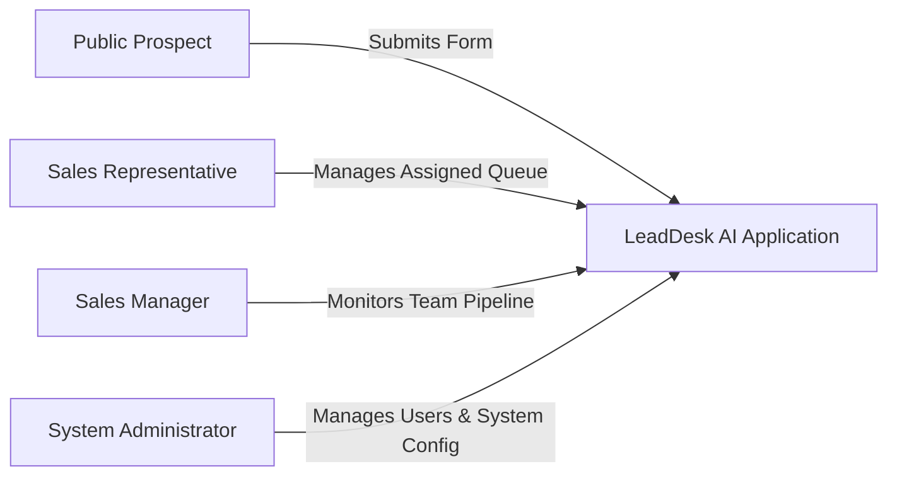

# 04 - Product Requirements Document (PRD)

## Table of Contents
1. [Document Overview & Scope](#1-document-overview--scope)
2. [User Personas & Role Profiles](#2-user-personas--role-profiles)
3. [User Stories & Acceptance Criteria](#3-user-stories--acceptance-criteria)
4. [Functional Scope Boundary](#4-functional-scope-boundary)
5. [Release Planning & Feature Roadmap](#5-release-planning--feature-roadmap)
6. [Success Metrics & KPI Tracking](#6-success-metrics--kpi-tracking)

---

## 1. Document Overview & Scope

This Product Requirements Document (PRD) defines the explicit functional capabilities, user interactions, scope boundaries, and acceptance criteria for **LeadDesk AI CRM**. It serves as the baseline contract between Product Management, Engineering, UI/UX Design, and Quality Assurance teams.

---

## 2. User Personas & Role Profiles

LeadDesk AI CRM serves four primary user roles, each defined by distinct access permissions and operational goals:



### Persona 1: Sarah Jenkins — Enterprise Sales Representative
* **Background**: High-volume B2B representative making 40+ contacts daily.
* **Goals**: Rapid access to new leads, instant lead details, zero UI latency, zero clutter.
* **Pain Points**: Wasting time filling out complex 15-field CRM updates for brief calls.
* **Key Requirements**: Single-click status updates, real-time list filtering, instant lead search.

### Persona 2: Marcus Vance — Director of Sales Operations
* **Background**: Oversees 25 sales reps, responsible for team productivity and lead conversion targets.
* **Goals**: Complete visibility into pipeline status, lead score distribution, and rep responsiveness.
* **Pain Points**: Leads sitting unserviced in generic queues without accountability.
* **Key Requirements**: Executive dashboard metrics, lead distribution audit trails, filterable reports.

### Persona 3: David Chen — System Administrator
* **Background**: Managing Director of IT Infrastructure & Governance.
* **Goals**: Enforce security policies, control user provisioning, safeguard prospect PII data.
* **Pain Points**: Unauthorized user access and unaudited data modifications.
* **Key Requirements**: Role-Based Access Control (RBAC), secure JWT authentication, detailed audit logs.

---

## 3. User Stories & Acceptance Criteria

### User Story US-01: Public Inbound Lead Submission
> **As a** prospective customer,  
> **I want to** submit my contact details and inquiry on a public landing page form,  
> **So that** a sales representative can promptly assist me.

#### Gherkin Acceptance Criteria:
```gherkin
Feature: Public Inbound Lead Capture
  Scenario: Valid Lead Form Submission
    Given I am an unauthenticated user on the public lead landing page
    When I fill in valid details for Name "Alice Smith", Email "alice@acme.com", Budget "50000", and Message "Interested in Enterprise plan"
    And I submit the form
    Then the client validates the fields with Zod
    And sends a POST request to "/api/v1/leads"
    And the server validates inputs, assigns score "Hot" (budget >= 50000), and sets status to "New"
    And returns HTTP 201 Created with lead ID
    And the landing page presents a green success confirmation toast.

  Scenario: Invalid Email Submission
    Given I am on the public lead landing page
    When I enter an invalid email format "alice@invalid-email"
    And submit the form
    Then client validation blocks submission
    And renders an inline field error message "Please enter a valid email address".
```

---

### User Story US-02: Sales Rep Lead Queue Filtering & Search
> **As a** Sales Representative,  
> **I want to** search and filter my assigned leads by keyword, status, and score tier,  
> **So that** I can prioritize my outreach to high-value prospects.

#### Gherkin Acceptance Criteria:
```gherkin
Feature: Real-Time Lead List Search and Filter
  Scenario: Filter Leads by Status "New" and Search Keyword
    Given I am logged in as a Sales Rep with a valid JWT token
    When I navigate to the Leads Dashboard
    And I enter "Acme" in the search bar
    And I select Status filter "New"
    Then the lead list updates dynamically without full page refresh
    And displays only leads containing "Acme" in Name/Email with status "New"
    And the table indicates total matching record count.
```

---

### User Story US-03: Single-Click Status Transition & Audit Logging
> **As a** Sales Representative or Sales Manager,  
> **I want to** change a lead's status from "New" to "Contacted", "Qualified", or "Closed",  
> **So that** the pipeline accurately reflects current deal progression.

#### Gherkin Acceptance Criteria:
```gherkin
Feature: Lead Status Update
  Scenario: Authorized Status Change
    Given I am logged in as an authorized user
    When I select lead "LD-1092" and change status to "Qualified"
    Then an API request `PATCH /api/v1/leads/LD-1092/status` is dispatched
    And the database updates the lead's status and records an audit entry
    And the UI updates optimistically with a success toast notification.
```

---

## 4. Functional Scope Boundary

```mermaid
graph TD
    subgraph In Scope (Release 1.0)
        F1[Public Form & Ingestion API]
        F2[Automated Rule-Based AI Scoring]
        F3[JWT Auth & RBAC Middleware]
        F4[Lead Management Dashboard]
        F5[Status Pipeline State Machine]
        F6[PostgreSQL Audit Trail]
    end
    subgraph Out of Scope (Future Releases)
        O1[Native VoIP In-Browser Dialing]
        O2[Bi-Directional Email Sync]
        O3[Third-party Zapier / Webhooks]
        O4[Multi-Currency Conversions]
    end
```

---

## 5. Release Planning & Feature Roadmap

| Milestone | Deliverable / Capability | Tech Stack Focus | Target Completion |
| :--- | :--- | :--- | :--- |
| **Phase 1: Architecture & DB** | Schema creation, UUID setup, migration scripts | Supabase PostgreSQL | Sprint 1 |
| **Phase 2: Core Express API** | Ingestion, Validation, Auth & RBAC routes | Node.js / Express | Sprint 2 |
| **Phase 3: React 19 Frontend** | Landing Page, Auth Login, Dashboard UI | React 19 / Tailwind | Sprint 3 |
| **Phase 4: AI & Audit Engine** | Intent scoring logic, activity logging triggers | Express / PostgreSQL | Sprint 4 |
| **Phase 5: E2E QA & Deploy** | Integration testing, Vercel & Render deployment | GitHub Actions / Vercel | Sprint 5 |

---

## 6. Success Metrics & KPI Tracking

The product performance will be continuously measured using the following baseline targets:

* **Conversion Rate Increase**: 25% minimum increase in leads converted to qualified stage.
* **System Latency**: 95th percentile API response time under 200ms.
* **Form Completion Rate**: Public submission completion rate exceeding 70%.
* **Zero Security Violations**: 100% pass rate on OWASP vulnerability assessments.

---

## Cross-References
* Business Requirements: [03-Business-Requirements.md](file:///C:/Users/PC/.gemini/antigravity/scratch/leaddesk-ai-crm/docs/03-Business-Requirements.md)
* Functional Specifications: [05-Functional-Requirements.md](file:///C:/Users/PC/.gemini/antigravity/scratch/leaddesk-ai-crm/docs/05-Functional-Requirements.md)
* System Architecture: [07-System-Architecture.md](file:///C:/Users/PC/.gemini/antigravity/scratch/leaddesk-ai-crm/docs/07-System-Architecture.md)
* API Specification: [15-API-Specification.md](file:///C:/Users/PC/.gemini/antigravity/scratch/leaddesk-ai-crm/docs/15-API-Specification.md)
