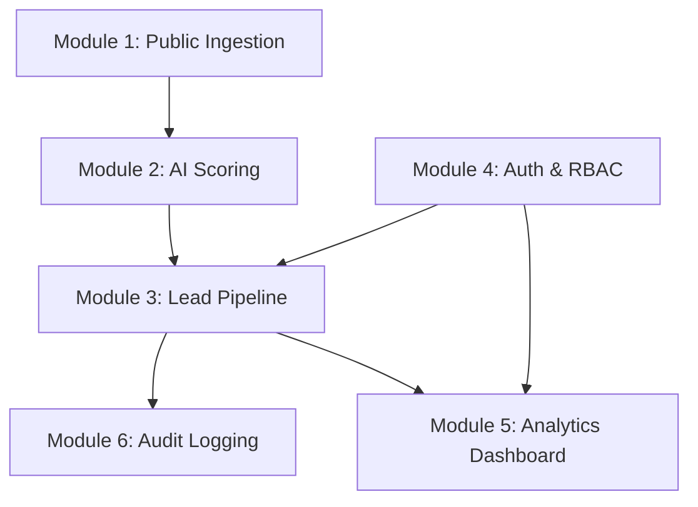
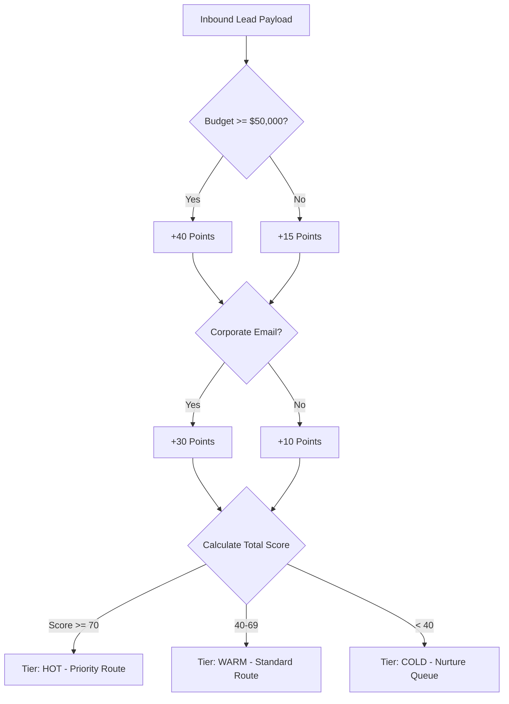

# 05 - Functional Requirements

## Table of Contents
1. [Functional Module Overview](#1-functional-module-overview)
2. [Module 1: Public Lead Ingestion & Validation](#2-module-1-public-lead-ingestion--validation)
3. [Module 2: Automated AI Lead Scoring & Classification](#3-module-2-automated-ai-lead-scoring--classification)
4. [Module 3: Lead Management Pipeline & State Machine](#4-module-3-lead-management-pipeline--state-machine)
5. [Module 4: User Authentication & Role-Based Access Control (RBAC)](#5-module-4-user-authentication--role-based-access-control-rbac)
6. [Module 5: Admin Analytics & Executive Dashboard](#6-module-5-admin-analytics--executive-dashboard)
7. [Module 6: Audit Logging & Activity Tracking](#7-module-6-audit-logging--activity-tracking)

---

## 1. Functional Module Overview

**LeadDesk AI CRM** consists of six core functional modules operating seamlessly across client and server tiers:

---

## 2. Module 1: Public Lead Ingestion & Validation

### Requirement Specification FR-1.1: Web Lead Capture Form
* **FR-1.1.1**: System MUST render a public-facing lead submission form accessible via standard browsers without authentication.
* **FR-1.1.2**: Form MUST collect Full Name, Email Address, Phone (optional), Budget Range, Company Name (optional), and Inquiry Message.
* **FR-1.1.3**: Client MUST perform instant client-side schema validation using Zod before issuing HTTP requests.
* **FR-1.1.4**: Server MUST execute Express Validator sanitization on all fields to strip HTML/Script tags (XSS defense).

### Requirement Specification FR-1.2: Ingestion API Endpoint
* **FR-1.2.1**: System MUST expose HTTP `POST /api/v1/leads` for processing inbound leads.
* **FR-1.2.2**: Endpoint MUST handle CORS pre-flight requests from verified domain origins.
* **FR-1.2.3**: Endpoint MUST generate a unique UUIDv4 identifier for every accepted lead.

---

## 3. Module 2: Automated AI Lead Scoring & Classification

### Requirement Specification FR-2.1: Automated Intent Classifier
* **FR-2.1.1**: System MUST compute an initial Lead Score (0–100) immediately upon ingestion.
* **FR-2.1.2**: Scoring algorithm MUST weigh Budget (> $50k = +40 pts), Message Length / Keyword Intent (+30 pts), and Corporate Email Domain (+30 pts).

---

## 4. Module 3: Lead Management Pipeline & State Machine

### Requirement Specification FR-3.1: Lead Pipeline States
* **FR-3.1.1**: Lead status MUST adhere strictly to the following enumerated state machine:
  * `New` (Default status upon ingestion)
  * `Contacted` (Sales rep has attempted touchpoint)
  * `Qualified` (Sales rep confirmed buying capability)
  * `Proposal Sent` (Commercial proposal delivered)
  * `Closed Won` (Deal closed successfully)
  * `Closed Lost` (Deal lost or unqualified)

### Requirement Specification FR-3.2: State Machine Transition Rules
* **FR-3.2.1**: Terminal states (`Closed Won`, `Closed Lost`) CANNOT transition back to `New`.
* **FR-3.2.2**: Only users with roles `Admin` or `Sales Rep` assigned to the lead can transition lead states.

---

## 5. Module 4: User Authentication & Role-Based Access Control (RBAC)

### Requirement Specification FR-4.1: JWT Authentication
* **FR-4.1.1**: System MUST authenticate users via HTTP `POST /api/v1/auth/login` accepting Email and Password.
* **FR-4.1.2**: Passwords MUST be verified against stored Bcrypt hashes (minimum salt rounds = 12).
* **FR-4.1.3**: Successful authentication MUST return a signed JSON Web Token (JWT) with an expiration time of 24 hours.

### Requirement Specification FR-4.2: RBAC Matrix

| Role | Access Scope | Lead Read | Lead Create | Lead Edit Status | User Admin |
| :--- | :--- | :--- | :--- | :--- | :--- |
| **Super Admin** | System Wide | Full | Yes | Yes | Full |
| **Sales Manager** | Team Wide | Full | Yes | Yes | Read Only |
| **Sales Rep** | Assigned Leads | Assigned | Yes | Assigned Only | No Access |
| **Public User** | Public Form | No Access | Ingestion Only | No Access | No Access |

---

## 6. Module 5: Admin Analytics & Executive Dashboard

### Requirement Specification FR-5.1: Key Performance Metrics
* **FR-5.1.1**: Dashboard MUST display Total Lead Volume, Active Leads, Conversion Rate (%), Average Response Time, and Score Tier Distribution.
* **FR-5.1.2**: Visual pipeline charts MUST update dynamically based on date range filters (Today, Last 7 Days, Last 30 Days).

---

## 7. Module 6: Audit Logging & Activity Tracking

### Requirement Specification FR-6.1: Immutable Activity Trail
* **FR-6.1.1**: Every lead creation, status transition, assignment change, or note addition MUST emit an immutable audit event to `audit_logs` table.
* **FR-6.1.2**: Log payload MUST capture `actor_id`, `action_type`, `lead_id`, `previous_state`, `new_state`, `ip_address`, and `timestamp`.

---

## Cross-References
* Business Requirements: [03-Business-Requirements.md](file:///C:/Users/PC/.gemini/antigravity/scratch/leaddesk-ai-crm/docs/03-Business-Requirements.md)
* PRD Specifications: [04-Product-Requirements-Document.md](file:///C:/Users/PC/.gemini/antigravity/scratch/leaddesk-ai-crm/docs/04-Product-Requirements-Document.md)
* Non-Functional Requirements: [06-NonFunctional-Requirements.md](file:///C:/Users/PC/.gemini/antigravity/scratch/leaddesk-ai-crm/docs/06-NonFunctional-Requirements.md)
* Database Schema: [09-Database-Design.md](file:///C:/Users/PC/.gemini/antigravity/scratch/leaddesk-ai-crm/docs/09-Database-Design.md)
