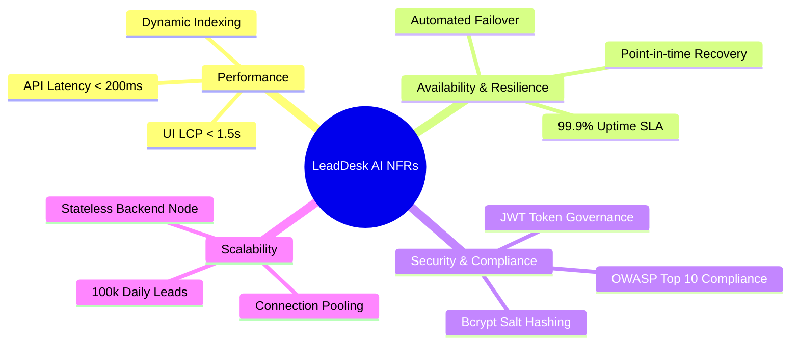
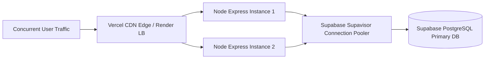

# 06 - Non-Functional Requirements

## Table of Contents
1. [NFR Categories & Performance Criteria](#1-nfr-categories--performance-criteria)
2. [Performance & Response Latency Benchmarks](#2-performance--response-latency-benchmarks)
3. [Availability, Reliability & Disaster Recovery](#3-availability-reliability--disaster-recovery)
4. [Scalability & Capacity Planning](#4-scalability--capacity-planning)
5. [Security & Compliance Standards](#5-security--compliance-standards)
6. [Maintainability & Code Quality Standards](#6-maintainability--code-quality-standards)
7. [Accessibility & Browser Compatibility](#7-accessibility--browser-compatibility)

---

## 1. NFR Categories & Performance Criteria

Non-Functional Requirements (NFRs) define the operational quality attributes, technical constraints, and governance standards that **LeadDesk AI CRM** must satisfy.

---

## 2. Performance & Response Latency Benchmarks

### Benchmark SLA Matrix:

| Operational Metric | Target Threshold | Maximum Allowable Ceiling | Verification Method |
| :--- | :--- | :--- | :--- |
| **API Lead Ingestion Response Time** | < 100 ms | 200 ms (p95) | K6 Load Testing Scripts |
| **API Auth & Login Duration** | < 150 ms | 300 ms (p95) | Express benchmark middleware |
| **Frontend Initial Page Load (LCP)** | < 1.2 s | 1.8 s | Google Lighthouse Audit |
| **Lead Filtering UI Update Latency** | < 50 ms | 100 ms | React Profiler DevTools |
| **Database Query Execution Time** | < 25 ms | 50 ms | PostgreSQL EXPLAIN ANALYZE |

---

## 3. Availability, Reliability & Disaster Recovery

* **Uptime SLA**: System MUST guarantee 99.9% operational availability (maximum unplanned downtime < 8.76 hours/year).
* **High Availability Architecture**: Node.js backend deployed across multi-zone containerized instances on Render with automated instance health checks.
* **Database Backup & Recovery**: Supabase managed PostgreSQL with continuous WAL archiving, daily automated backups, and 30-day point-in-time recovery (PITR).
* **Recovery Time Objective (RTO)**: Maximum acceptable system restoration time < 15 minutes.
* **Recovery Point Objective (RPO)**: Maximum acceptable data loss window < 1 minute.

---

## 4. Scalability & Capacity Planning

* **Horizontal Stateless Scaling**: Node.js/Express backend MUST remain completely stateless, relying on JWT tokens for session verification.
* **Database Connection Pooling**: Database connections managed via Supabase Supavisor pooler (up to 1,000 concurrent client connections).
* **Storage Growth Plan**: Database schema designed to support 50,000,000 lead records without indexing degradation.

---

## 5. Security & Compliance Standards

* **OWASP Compliance**: Full coverage against OWASP Top 10 vulnerabilities (SQLi, XSS, Broken Auth, CSRF).
* **Data at Rest**: AES-256 encryption applied to all database tables and backups.
* **Data in Transit**: Enforcement of TLS 1.3 encryption across all client-server and server-database communication.
* **Secret Management**: Zero hardcoded secrets; configuration injected strictly via environment variables (`.env`).

---

## 6. Maintainability & Code Quality Standards

* **Code Test Coverage**: Minimum 85% unit test coverage for core business services and validation middleware.
* **Linting & Formatting**: Strict compliance with ESLint rules and Prettier formatting scripts.
* **Modular Codebase**: Strict adherence to Separation of Concerns (Routes -> Controllers -> Services -> Repositories).

---

## 7. Accessibility & Browser Compatibility

* **WCAG 2.1 AA Compliance**: All React UI components MUST meet Web Content Accessibility Guidelines AA standard.
* **Screen Reader & Keyboard Nav**: Form inputs, buttons, and status toggles MUST feature full ARIA attributes and focus styling.
* **Browser Matrix**: Full functional support across Chrome (latest 2 versions), Firefox (latest 2 versions), Safari (latest 2 versions), and Edge.

---

## Cross-References
* Functional Requirements: [05-Functional-Requirements.md](file:///C:/Users/PC/.gemini/antigravity/scratch/leaddesk-ai-crm/docs/05-Functional-Requirements.md)
* System Architecture: [07-System-Architecture.md](file:///C:/Users/PC/.gemini/antigravity/scratch/leaddesk-ai-crm/docs/07-System-Architecture.md)
* Security Design: [17-Security-Design.md](file:///C:/Users/PC/.gemini/antigravity/scratch/leaddesk-ai-crm/docs/17-Security-Design.md)
* Testing Strategy: [29-Testing-Strategy.md](file:///C:/Users/PC/.gemini/antigravity/scratch/leaddesk-ai-crm/docs/29-Testing-Strategy.md)
