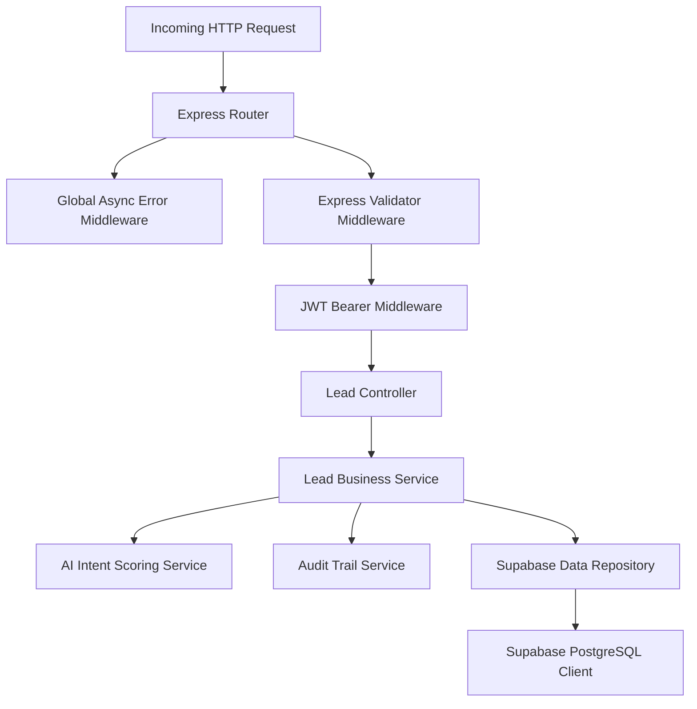
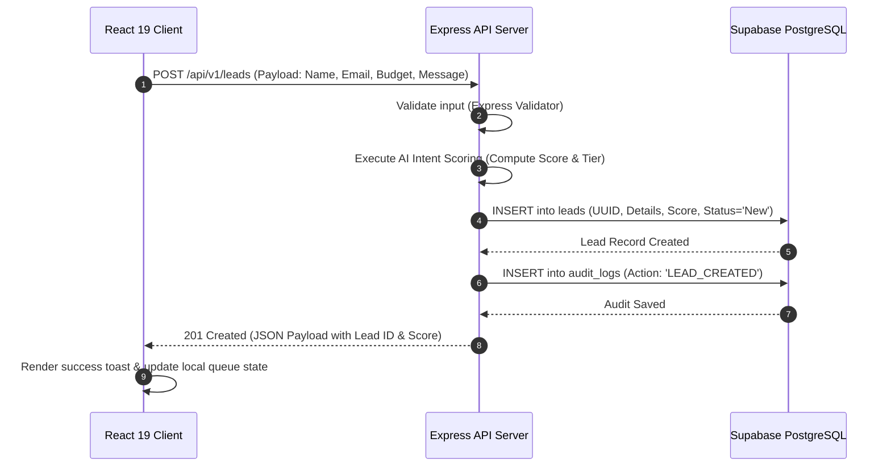
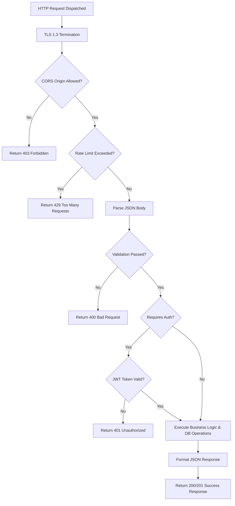

# 07 - System Architecture

## Table of Contents
1. [Architectural Overview & Principles](#1-architectural-overview--principles)
2. [High-Level System Architecture](#2-high-level-system-architecture)
3. [Low-Level Component Topology](#3-low-level-component-topology)
4. [Client-Server Interaction Pattern](#4-client-server-interaction-pattern)
5. [End-to-End Request Lifecycle](#5-end-to-end-request-lifecycle)
6. [Authentication & Data Flow Architecture](#6-authentication--data-flow-architecture)
7. [Scalability & Reliability Strategy](#7-scalability--reliability-strategy)

---

## 1. Architectural Overview & Principles

**LeadDesk AI CRM** uses a high-performance, decoupled client-server architecture designed for reliability, sub-200ms latency, and continuous scalability. The architecture enforces strict Separation of Concerns (SoC), stateless API execution, and robust relational data management.

### Key Architectural Principles:
* **Stateless API Tier**: Express.js services maintain zero session state, authorizing requests purely via signed JWT tokens.
* **Component-Driven Frontend**: React 19 single-page application (SPA) with declarative UI components, Zod schema validation, and Axios client abstractions.
* **Relational Integrity at Scale**: Supabase managed PostgreSQL with row-level security, partial indexing, and foreign key enforcement.
* **Defensive Boundary Security**: Input validation at client and server boundaries, security headers via Helmet, rate limiting, and CORS restrictions.

---

## 2. High-Level System Architecture

The high-level architecture separates the application into Presentation, API & Business Logic, and Data Persistence layers:

```mermaid
graph TB
    subgraph Presentation Layer (Vercel CDN Edge)
        ReactApp[React 19 SPA]
        TailwindCSS[Tailwind CSS Styling]
        Router[React Router v7]
        ReactForm[React Hook Form + Zod]
    end

    subgraph API & Logic Tier (Render Node Environment)
        ExpressApp[Express.js Server Engine]
        HelmetSec[Helmet & CORS Middleware]
        RateLimit[Express Rate Limiter]
        AuthMW[JWT Auth Middleware]
        LeadCtrl[Lead Controllers]
        ScoreEngine[AI Intent Scoring Engine]
        AuditEngine[Audit Logging Service]
    end

    subgraph Data & Storage Layer (Supabase Cloud)
        SupabasePool[Supavisor Connection Pooler]
        Postgres[(PostgreSQL Database)]
        LeadTable[(Leads Table)]
        UserTable[(Users Table)]
        AuditTable[(Audit Logs Table)]
    end

    ReactApp -->|HTTPS / REST API| ExpressApp
    ExpressApp --> HelmetSec --> RateLimit --> AuthMW
    AuthMW --> LeadCtrl
    LeadCtrl --> ScoreEngine
    LeadCtrl --> AuditEngine
    LeadCtrl -->|SQL / Supabase Client| SupabasePool
    SupabasePool --> Postgres
    Postgres --- LeadTable
    Postgres --- UserTable
    Postgres --- AuditTable
```

---

## 3. Low-Level Component Topology

The diagram below details how internal modules communicate within the backend runtime:



---

## 4. Client-Server Interaction Pattern

Communication between the React 19 SPA and Express.js backend occurs exclusively via asynchronous RESTful HTTP endpoints using JSON payloads.



---

## 5. End-to-End Request Lifecycle



---

## 6. Authentication & Data Flow Architecture

User authentication leverages stateless JSON Web Tokens (JWT). Upon successful login, the client receives an encrypted token stored in-memory (or secure HTTP-only cookies) and passes it in the `Authorization: Bearer <token>` header for protected routes.

---

## 7. Scalability & Reliability Strategy

1. **Stateless API Execution**: Backend nodes can be auto-scaled dynamically across Render containers without session synchronization issues.
2. **Database Optimization**: Supabase PostgreSQL uses partial B-tree indexing on active leads (`status != 'Closed Lost'`) to ensure rapid query responses.
3. **Failover Resilience**: Managed database hosting guarantees continuous uptime with multi-region backup replication.

---

## Cross-References
* Executive Summary: [01-Executive-Summary.md](file:///C:/Users/PC/.gemini/antigravity/scratch/leaddesk-ai-crm/docs/01-Executive-Summary.md)
* Tech Stack: [08-Technology-Stack.md](file:///C:/Users/PC/.gemini/antigravity/scratch/leaddesk-ai-crm/docs/08-Technology-Stack.md)
* Database Design: [09-Database-Design.md](file:///C:/Users/PC/.gemini/antigravity/scratch/leaddesk-ai-crm/docs/09-Database-Design.md)
* Deployment Architecture: [14-Deployment-Architecture.md](file:///C:/Users/PC/.gemini/antigravity/scratch/leaddesk-ai-crm/docs/14-Deployment-Architecture.md)
