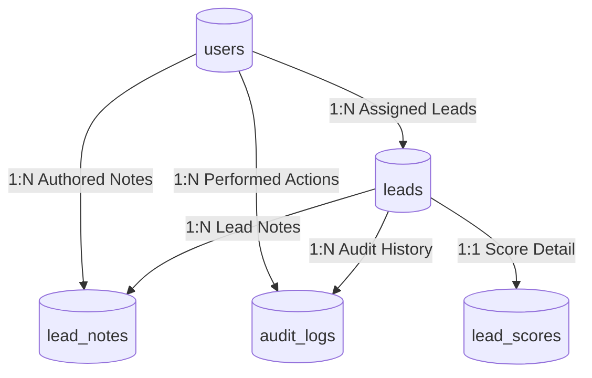

# 09 - Database Design

## Table of Contents
1. [Database Strategy & Architectural Pillars](#1-database-strategy--architectural-pillars)
2. [Data Model Architecture](#2-data-model-architecture)
3. [Complete SQL DDL Schema Specifications](#3-complete-sql-ddl-schema-specifications)
4. [Primary Key & UUID Strategy](#4-primary-key--uuid-strategy)
5. [Soft Delete Strategy & Purge Rules](#5-soft-delete-strategy--purge-rules)
6. [Audit Columns & Automated Triggers](#6-audit-columns--automated-triggers)
7. [Indexing Strategy & Query Optimization](#7-indexing-strategy--query-optimization)

---

## 1. Database Strategy & Architectural Pillars

**LeadDesk AI CRM** uses **Supabase PostgreSQL** as its primary relational store. The database design emphasizes strict relational integrity, high-concurrency read throughput, immutable auditability, and automated timestamp management.

### Architectural Pillars:
* **UUIDv4 Identifiers**: All primary keys utilize globally unique 128-bit UUIDs (`gen_random_uuid()`) to eliminate enumeration attacks and facilitate multi-region distribution.
* **Soft Delete Governance**: Active business tables enforce soft deletion via `deleted_at IS NULL` filters, ensuring zero unrecoverable data loss.
* **Automated Audit Triggers**: PostgreSQL PL/pgSQL triggers automatically capture timestamp updates and write change vectors to `audit_logs`.

---

## 2. Data Model Architecture



---

## 3. Complete SQL DDL Schema Specifications

```sql
-- Enable UUID Extension
CREATE EXTENSION IF NOT EXISTS "uuid-ossp";

-- =============================================================================
-- TABLE 1: USERS (System Users & Roles)
-- =============================================================================
CREATE TYPE user_role AS ENUM ('super_admin', 'sales_manager', 'sales_rep');

CREATE TABLE users (
    id UUID PRIMARY KEY DEFAULT gen_random_uuid(),
    email VARCHAR(255) NOT NULL UNIQUE,
    password_hash VARCHAR(255) NOT NULL,
    full_name VARCHAR(150) NOT NULL,
    role user_role NOT NULL DEFAULT 'sales_rep',
    is_active BOOLEAN NOT NULL DEFAULT TRUE,
    last_login_at TIMESTAMPTZ,
    created_at TIMESTAMPTZ NOT NULL DEFAULT CURRENT_TIMESTAMP,
    updated_at TIMESTAMPTZ NOT NULL DEFAULT CURRENT_TIMESTAMP,
    deleted_at TIMESTAMPTZ DEFAULT NULL
);

-- =============================================================================
-- TABLE 2: LEADS (Core Inbound Leads)
-- =============================================================================
CREATE TYPE lead_status AS ENUM ('New', 'Contacted', 'Qualified', 'Proposal Sent', 'Closed Won', 'Closed Lost');
CREATE TYPE score_tier AS ENUM ('Hot', 'Warm', 'Cold');

CREATE TABLE leads (
    id UUID PRIMARY KEY DEFAULT gen_random_uuid(),
    full_name VARCHAR(150) NOT NULL,
    email VARCHAR(255) NOT NULL,
    phone VARCHAR(50),
    company VARCHAR(150),
    budget NUMERIC(12, 2) NOT NULL DEFAULT 0.00,
    message TEXT NOT NULL,
    status lead_status NOT NULL DEFAULT 'New',
    score_value INT NOT NULL DEFAULT 0,
    score_tier score_tier NOT NULL DEFAULT 'Cold',
    assigned_to UUID REFERENCES users(id) ON DELETE SET NULL,
    created_at TIMESTAMPTZ NOT NULL DEFAULT CURRENT_TIMESTAMP,
    updated_at TIMESTAMPTZ NOT NULL DEFAULT CURRENT_TIMESTAMP,
    deleted_at TIMESTAMPTZ DEFAULT NULL
);

-- =============================================================================
-- TABLE 3: LEAD_NOTES (Rep Notes & Communication)
-- =============================================================================
CREATE TABLE lead_notes (
    id UUID PRIMARY KEY DEFAULT gen_random_uuid(),
    lead_id UUID NOT NULL REFERENCES leads(id) ON DELETE CASCADE,
    author_id UUID NOT NULL REFERENCES users(id) ON DELETE RESTRICT,
    note_text TEXT NOT NULL,
    created_at TIMESTAMPTZ NOT NULL DEFAULT CURRENT_TIMESTAMP,
    updated_at TIMESTAMPTZ NOT NULL DEFAULT CURRENT_TIMESTAMP
);

-- =============================================================================
-- TABLE 4: AUDIT_LOGS (Immutable System Audit Trail)
-- =============================================================================
CREATE TABLE audit_logs (
    id UUID PRIMARY KEY DEFAULT gen_random_uuid(),
    actor_id UUID REFERENCES users(id) ON DELETE SET NULL,
    lead_id UUID REFERENCES leads(id) ON DELETE SET NULL,
    action VARCHAR(100) NOT NULL,
    previous_state JSONB,
    new_state JSONB,
    ip_address VARCHAR(45),
    created_at TIMESTAMPTZ NOT NULL DEFAULT CURRENT_TIMESTAMP
);
```

---

## 4. Primary Key & UUID Strategy

All primary key columns rely on standard PostgreSQL `UUID` types backed by `gen_random_uuid()`. Key advantages include:
1. **Unpredictable URLs**: Prevents sequential ID scanning (e.g., `/leads/101` vs `/leads/9b1deb4d-3b7d-4bad-9bdd-2b0d7b3dcb6d`).
2. **Distributed Compatibility**: Facilitates offline lead queue sync and cross-database merging.

---

## 5. Soft Delete Strategy & Purge Rules

To prevent accidental data loss, deletions do not execute SQL `DELETE`. Instead:
* Applications issue: `UPDATE leads SET deleted_at = CURRENT_TIMESTAMP WHERE id = $1;`
* Queries automatically append filter: `WHERE deleted_at IS NULL`
* Hard purge script runs via background cron for records where `deleted_at < NOW() - INTERVAL '90 days'`.

---

## 6. Audit Columns & Automated Triggers

```sql
-- Automated Timestamp Function
CREATE OR REPLACE FUNCTION update_timestamp_column()
RETURNS TRIGGER AS $$
BEGIN
   NEW.updated_at = NOW();
   RETURN NEW;
END;
$$ language 'plpgsql';

CREATE TRIGGER update_leads_timestamp BEFORE UPDATE ON leads
FOR EACH ROW EXECUTE PROCEDURE update_timestamp_column();
```

---

## 7. Indexing Strategy & Query Optimization

To maintain sub-50ms query execution across millions of rows, the database uses specific B-tree indexes:

```sql
-- Search & Filtering Index
CREATE INDEX idx_leads_search_status ON leads (status, score_tier) WHERE deleted_at IS NULL;
CREATE INDEX idx_leads_assigned ON leads (assigned_to) WHERE deleted_at IS NULL;
CREATE INDEX idx_leads_email ON leads (email);
CREATE INDEX idx_audit_lead ON audit_logs (lead_id, created_at DESC);
```

---

## Cross-References
* Tech Stack: [08-Technology-Stack.md](file:///C:/Users/PC/.gemini/antigravity/scratch/leaddesk-ai-crm/docs/08-Technology-Stack.md)
* ER Diagram: [10-ER-Diagram.md](file:///C:/Users/PC/.gemini/antigravity/scratch/leaddesk-ai-crm/docs/10-ER-Diagram.md)
* Class Diagram: [11-Class-Diagram.md](file:///C:/Users/PC/.gemini/antigravity/scratch/leaddesk-ai-crm/docs/11-Class-Diagram.md)
* API Specification: [15-API-Specification.md](file:///C:/Users/PC/.gemini/antigravity/scratch/leaddesk-ai-crm/docs/15-API-Specification.md)
