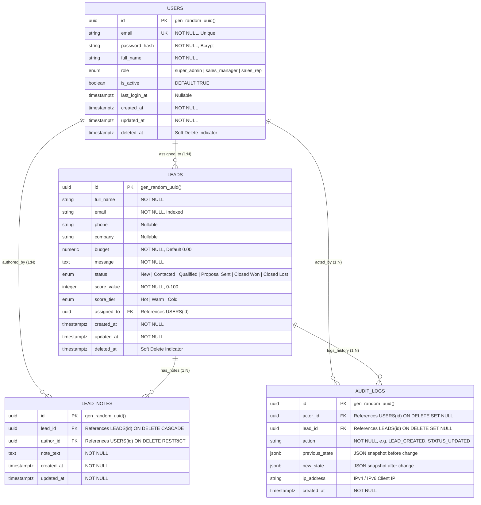

# 10 - ER Diagram

## Table of Contents
1. [Entity-Relationship Overview](#1-entity-relationship-overview)
2. [Complete Mermaid ER Diagram](#2-complete-mermaid-er-diagram)
3. [Entity Dictionary & Data Attributes](#3-entity-dictionary--data-attributes)
4. [Relationship Cardinality & Integrity Rules](#4-relationship-cardinality--integrity-rules)

---

## 1. Entity-Relationship Overview

This document presents the complete conceptual and logical Entity-Relationship (ER) schema for **LeadDesk AI CRM**. It details all database entities, primary keys, foreign key constraints, column data types, nullability rules, and cardinalities.

---

## 2. Complete Mermaid ER Diagram

---

## 3. Entity Dictionary & Data Attributes

### 1. `USERS` Entity
Represents internal organization users (Admins, Managers, Sales Representatives) authenticated to access the system.

### 2. `LEADS` Entity
Core business entity storing inbound lead prospects, budget information, calculated intent scores, and status lifecycle state.

### 3. `LEAD_NOTES` Entity
Contains time-stamped contextual comments written by sales representatives for a specific lead.

### 4. `AUDIT_LOGS` Entity
System audit repository capturing immutable change records for compliance and reporting.

---

## 4. Relationship Cardinality & Integrity Rules

| Parent Entity | Child Entity | Foreign Key Field | Cardinality | Delete Cascade Rule |
| :--- | :--- | :--- | :--- | :--- |
| `USERS` | `LEADS` | `leads.assigned_to` | 1 to 0..N | `ON DELETE SET NULL` |
| `USERS` | `LEAD_NOTES` | `lead_notes.author_id` | 1 to 0..N | `ON DELETE RESTRICT` |
| `USERS` | `AUDIT_LOGS` | `audit_logs.actor_id` | 1 to 0..N | `ON DELETE SET NULL` |
| `LEADS` | `LEAD_NOTES` | `lead_notes.lead_id` | 1 to 0..N | `ON DELETE CASCADE` |
| `LEADS` | `AUDIT_LOGS` | `audit_logs.lead_id` | 1 to 0..N | `ON DELETE SET NULL` |

---

## Cross-References
* System Architecture: [07-System-Architecture.md](file:///C:/Users/PC/.gemini/antigravity/scratch/leaddesk-ai-crm/docs/07-System-Architecture.md)
* Database Design: [09-Database-Design.md](file:///C:/Users/PC/.gemini/antigravity/scratch/leaddesk-ai-crm/docs/09-Database-Design.md)
* Class Diagram: [11-Class-Diagram.md](file:///C:/Users/PC/.gemini/antigravity/scratch/leaddesk-ai-crm/docs/11-Class-Diagram.md)
* API Specification: [15-API-Specification.md](file:///C:/Users/PC/.gemini/antigravity/scratch/leaddesk-ai-crm/docs/15-API-Specification.md)
