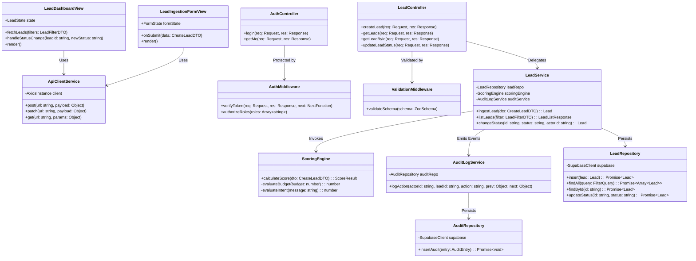

# 11 - Class Diagram

## Table of Contents
1. [Class Architecture Overview](#1-class-architecture-overview)
2. [Complete Mermaid UML Class Diagram](#2-complete-mermaid-uml-class-diagram)
3. [Class Specification & Responsibilities](#3-class-specification--responsibilities)
4. [Design Patterns Implemented](#4-design-patterns-implemented)

---

## 1. Class Architecture Overview

This document presents the Unified Modeling Language (UML) Class Diagram for **LeadDesk AI CRM**. It illustrates the object-oriented structure across client components, API controllers, domain services, database repositories, middleware guards, and data transfer objects (DTOs).

---

## 2. Complete Mermaid UML Class Diagram

---

## 3. Class Specification & Responsibilities

### Presentation Layer Classes (Client-side):
* **`LeadDashboardView`**: React 19 functional component orchestrating lead listing, searching, pagination, and optimistic UI updates.
* **`ApiClientService`**: Axios HTTP wrapper maintaining JWT authorization headers and global response interceptors.

### Application Layer Classes (Server-side):
* **`LeadController`**: Express route controller parsing incoming HTTP requests, executing middleware validation, and returning JSON responses.
* **`LeadService`**: Core domain logic orchestrating transaction workflow, AI scoring execution, audit emission, and persistence.
* **`ScoringEngine`**: Pure domain service computing quantitative intent scores (0–100) and assigned tiers (`Hot`, `Warm`, `Cold`).
* **`LeadRepository`**: Data access abstraction isolating Supabase PostgreSQL queries from higher-level business logic.

---

## 4. Design Patterns Implemented

1. **Repository Pattern**: `LeadRepository` decouples raw database SQL syntax from domain business rules in `LeadService`.
2. **Middleware Chain Pattern**: Express middleware pipeline (`Helmet -> Cors -> RateLimit -> Validation -> Auth -> Controller`).
3. **DTO (Data Transfer Object) Pattern**: Strict separation between API JSON payloads (`CreateLeadDTO`) and internal DB entities.
4. **Single Responsibility Principle (SRP)**: Scoring logic is strictly isolated within `ScoringEngine`.

---

## Cross-References
* System Architecture: [07-System-Architecture.md](file:///C:/Users/PC/.gemini/antigravity/scratch/leaddesk-ai-crm/docs/07-System-Architecture.md)
* ER Diagram: [10-ER-Diagram.md](file:///C:/Users/PC/.gemini/antigravity/scratch/leaddesk-ai-crm/docs/10-ER-Diagram.md)
* Component Diagram: [13-Component-Diagram.md](file:///C:/Users/PC/.gemini/antigravity/scratch/leaddesk-ai-crm/docs/13-Component-Diagram.md)
* Backend Architecture: [21-Backend-Architecture.md](file:///C:/Users/PC/.gemini/antigravity/scratch/leaddesk-ai-crm/docs/21-Backend-Architecture.md)
