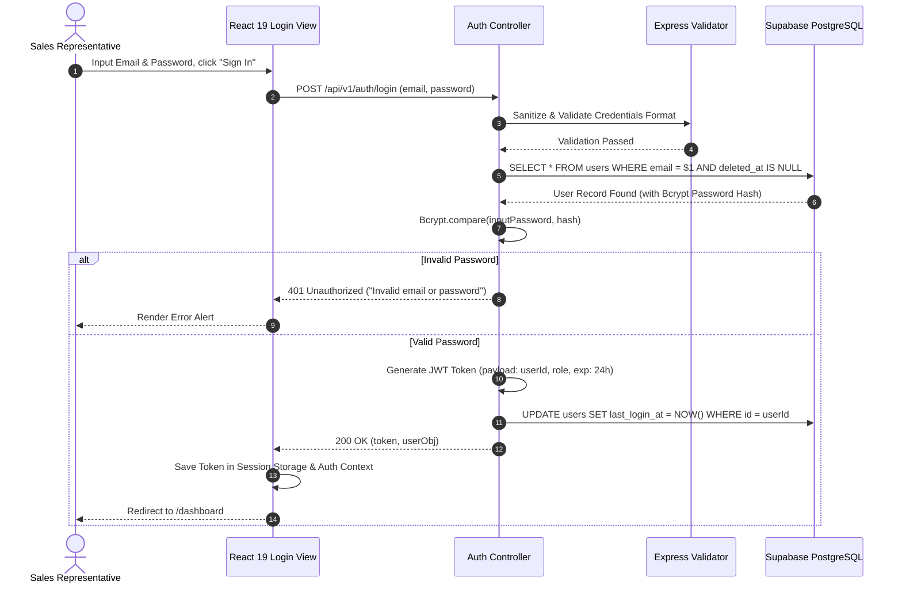
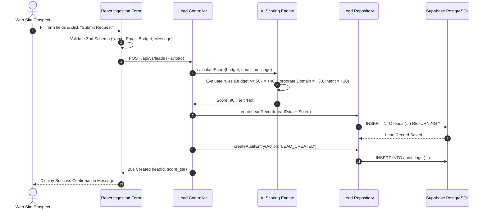
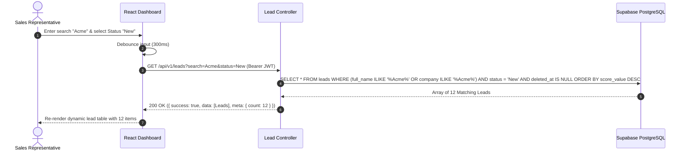
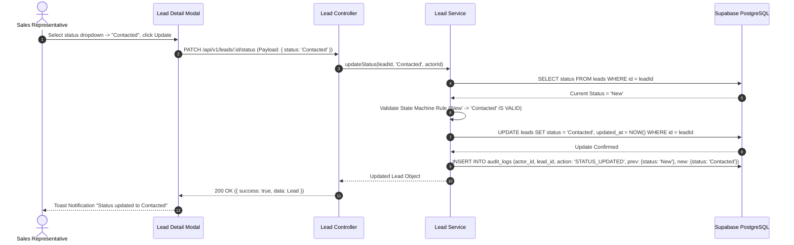
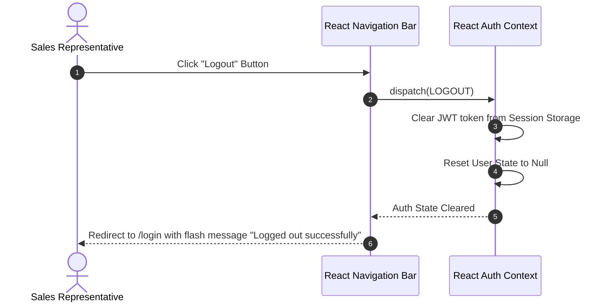
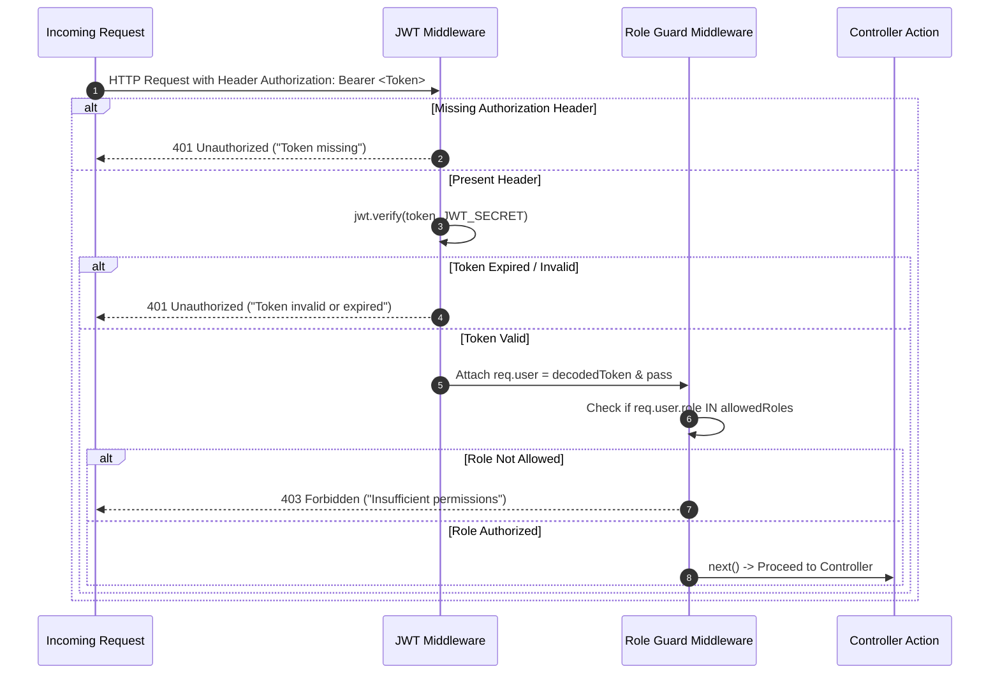
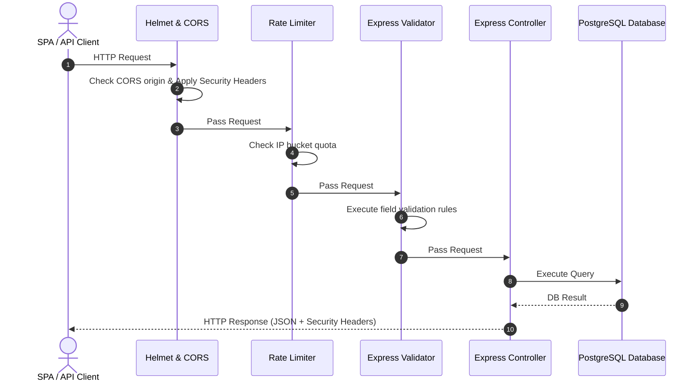

# 12 - Sequence Diagrams

## Table of Contents
1. [Sequence Diagrams Overview](#1-sequence-diagrams-overview)
2. [Diagram 1: User Login & Authentication](#2-diagram-1-user-login--authentication)
3. [Diagram 2: Public Lead Submission & Automated Scoring](#3-diagram-2-public-lead-submission--automated-scoring)
4. [Diagram 3: Lead Search & Multi-Filter Execution](#4-diagram-3-lead-search--multi-filter-execution)
5. [Diagram 4: Lead Status Transition & Audit Emission](#5-diagram-4-lead-status-transition--audit-emission)
6. [Diagram 5: User Logout & Session Invalidation](#6-diagram-5-user-logout--session-invalidation)
7. [Diagram 6: Middleware Auth Guard & RBAC Authorization](#7-diagram-6-middleware-auth-guard--rbac-authorization)
8. [Diagram 7: End-to-End API Request Lifecycle](#8-diagram-7-end-to-end-api-request-lifecycle)

---

## 1. Sequence Diagrams Overview

This document presents seven comprehensive Mermaid sequence diagrams capturing end-to-end interaction flows between Client UI, Middleware Guards, Controllers, Business Services, Database Repositories, and Audit Subsystems in **LeadDesk AI CRM**.

---

## 2. Diagram 1: User Login & Authentication

---

## 3. Diagram 2: Public Lead Submission & Automated Scoring

---

## 4. Diagram 3: Lead Search & Multi-Filter Execution

---

## 5. Diagram 4: Lead Status Transition & Audit Emission

---

## 6. Diagram 5: User Logout & Session Invalidation

---

## 7. Diagram 6: Middleware Auth Guard & RBAC Authorization

---

## 8. Diagram 7: End-to-End API Request Lifecycle

---

## Cross-References
* System Architecture: [07-System-Architecture.md](file:///C:/Users/PC/.gemini/antigravity/scratch/leaddesk-ai-crm/docs/07-System-Architecture.md)
* Class Diagram: [11-Class-Diagram.md](file:///C:/Users/PC/.gemini/antigravity/scratch/leaddesk-ai-crm/docs/11-Class-Diagram.md)
* API Specification: [15-API-Specification.md](file:///C:/Users/PC/.gemini/antigravity/scratch/leaddesk-ai-crm/docs/15-API-Specification.md)
* Security Design: [17-Security-Design.md](file:///C:/Users/PC/.gemini/antigravity/scratch/leaddesk-ai-crm/docs/17-Security-Design.md)
