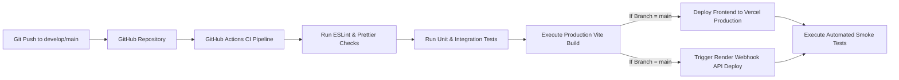

# 14 - Deployment Architecture

## Table of Contents
1. [Infrastructure & Cloud Topology Overview](#1-infrastructure--cloud-topology-overview)
2. [Complete Deployment Architecture Diagram](#2-complete-deployment-architecture-diagram)
3. [Environment Configuration & Hosting Providers](#3-environment-configuration--hosting-providers)
4. [CI/CD Deployment Pipeline Workflow](#4-cicd-deployment-pipeline-workflow)
5. [SSL/TLS, DNS & Edge Routing Strategy](#5-ssltls-dns--edge-routing-strategy)
6. [Disaster Recovery & Monitoring Topography](#6-disaster-recovery--monitoring-topography)

---

## 1. Infrastructure & Cloud Topology Overview

**LeadDesk AI CRM** utilizes a modern multi-cloud deployment architecture leveraging specialized managed platform providers to achieve optimal performance, high availability, zero operational overhead, and automated scale.

* **Frontend Hosting**: Vercel Global Edge Network (CDN).
* **Backend Runtime**: Render Web Service (Containerized Node.js Environment).
* **Database Infrastructure**: Supabase Managed Cloud (PostgreSQL 15+).
* **Source Control & CI/CD**: GitHub & GitHub Actions.

---

## 2. Complete Deployment Architecture Diagram

```mermaid
graph TB
    subgraph Client Layer
        Users[Web & Mobile Browsers]
    end

    subgraph Vercel Edge Network (Frontend CDN)
        DNS[Cloudflare / Vercel DNS]
        VercelCDN[Vercel Global Edge Network]
        ReactBundle[React 19 Static Assets]
    end

    subgraph Render Platform (Backend API Service)
        RenderLB[Render Load Balancer / SSL]
        NodeApp1[Node.js Container Instance 1]
        NodeApp2[Node.js Container Instance 2]
    end

    subgraph Supabase Cloud (Managed Data Layer)
        Supavisor[Supavisor Connection Pooler]
        PrimaryDB[(Primary PostgreSQL DB)]
        ReplicaDB[(Read Replica / Backup DB)]
    end

    Users -->|HTTPS Request| DNS
    DNS --> VercelCDN
    VercelCDN --- ReactBundle
    ReactBundle -->|API Requests over HTTPS| RenderLB
    RenderLB --> NodeApp1
    RenderLB --> NodeApp2
    NodeApp1 & NodeApp2 -->|Encrypted SSL SQL Queries| Supavisor
    Supavisor --> PrimaryDB
    PrimaryDB -.->|Continuous Replication| ReplicaDB
```

---

## 3. Environment Configuration & Hosting Providers

| Component | Platform | Configuration Specs | Environment Variables |
| :--- | :--- | :--- | :--- |
| **Frontend** | Vercel | SPA Static Deployment, Edge Caching | `VITE_API_BASE_URL` |
| **Backend** | Render | Node 20 LTS environment, Auto-restart | `PORT`, `NODE_ENV`, `JWT_SECRET`, `SUPABASE_URL`, `SUPABASE_ANON_KEY`, `CORS_ORIGIN` |
| **Database** | Supabase | PostgreSQL 15, SSL enabled, Supavisor enabled | Managed internally |

---

## 4. CI/CD Deployment Pipeline Workflow



---

## 5. SSL/TLS, DNS & Edge Routing Strategy

1. **Automatic SSL/TLS Provisioning**: Vercel and Render automatically provision and renew Let's Encrypt TLS 1.3 certificates.
2. **CORS Restrictions**: Render backend API validates incoming request headers against the whitelisted `CORS_ORIGIN` (e.g., `https://leaddesk-crm.vercel.app`).
3. **HTTP Security Headers**: Express app utilizes `Helmet` middleware to set `Strict-Transport-Security` (HSTS), `X-Content-Type-Options: nosniff`, and `X-Frame-Options: DENY`.

---

## 6. Disaster Recovery & Monitoring Topography

* **Health Check Probe**: Render pings `GET /api/v1/health` every 30 seconds. If a container fails 3 consecutive checks, a fresh instance is launched automatically.
* **Point-in-Time Recovery (PITR)**: Supabase maintains 30-day point-in-time recovery for immediate DB rollbacks in case of data corruption.

---

## Cross-References
* System Architecture: [07-System-Architecture.md](file:///C:/Users/PC/.gemini/antigravity/scratch/leaddesk-ai-crm/docs/07-System-Architecture.md)
* Tech Stack: [08-Technology-Stack.md](file:///C:/Users/PC/.gemini/antigravity/scratch/leaddesk-ai-crm/docs/08-Technology-Stack.md)
* Component Diagram: [13-Component-Diagram.md](file:///C:/Users/PC/.gemini/antigravity/scratch/leaddesk-ai-crm/docs/13-Component-Diagram.md)
* Deployment Guide: [33-Deployment-Guide.md](file:///C:/Users/PC/.gemini/antigravity/scratch/leaddesk-ai-crm/docs/33-Deployment-Guide.md)
