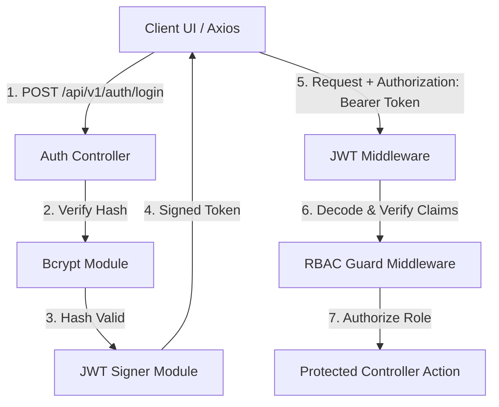

# 16 - Authentication & Authorization

## Table of Contents
1. [Authentication Architecture Overview](#1-authentication-architecture-overview)
2. [JWT Token Architecture & Claims Payload](#2-jwt-token-architecture--claims-payload)
3. [Password Hashing & Salt Policy](#3-password-hashing--salt-policy)
4. [Role-Based Access Control (RBAC) Matrix](#4-role-based-access-control-rbac-matrix)
5. [Route Protection Middleware Implementation](#5-route-protection-middleware-implementation)
6. [Session Lifecycle & Token Invalidation Strategy](#6-session-lifecycle--token-invalidation-strategy)

---

## 1. Authentication Architecture Overview

**LeadDesk AI CRM** implements stateless JSON Web Token (JWT) authentication coupled with strict server-side Role-Based Access Control (RBAC).



---

## 2. JWT Token Architecture & Claims Payload

JWT tokens are signed using HMAC SHA-256 (`HS256`) algorithms using a high-entropy secret key configured in environment variables (`JWT_SECRET`).

### Decoded Token Claims Structure:
```json
{
  "sub": "e4b6c31a-6415-4c07-9b88-12c8230b42f3",
  "email": "sarah.rep@leaddesk.io",
  "role": "sales_rep",
  "full_name": "Sarah Rep",
  "iat": 1784980800,
  "exp": 1785067200
}
```

* **Lifetime**: Tokens expire strictly 24 hours (`86400 seconds`) after generation.
* **Transmission**: Delivered via standard Authorization Header: `Authorization: Bearer <TOKEN>`.

---

## 3. Password Hashing & Salt Policy

All user passwords are hashed using `Bcrypt` before database storage:
* **Cost Factor / Salt Rounds**: `12` rounds.
* **Pre-save Enforcement**: Plaintext passwords are NEVER logged or saved to database columns.

---

## 4. Role-Based Access Control (RBAC) Matrix

The system enforces four distinct access tiers:

| Endpoint Resource | Public | Sales Rep | Sales Manager | Super Admin |
| :--- | :--- | :--- | :--- | :--- |
| `POST /api/v1/auth/login` | Allow | Allow | Allow | Allow |
| `POST /api/v1/leads` | Allow (Ingestion) | Allow | Allow | Allow |
| `GET /api/v1/leads` | Deny | Allow (Assigned) | Allow (All) | Allow (All) |
| `PATCH /api/v1/leads/:id/status` | Deny | Allow (Assigned) | Allow (All) | Allow (All) |
| `GET /api/v1/analytics/dashboard` | Deny | Deny | Allow | Allow |
| `POST /api/v1/users` | Deny | Deny | Deny | Allow |

---

## 5. Route Protection Middleware Implementation

```javascript
// Middleware: Express JWT Authentication Guard
const authenticateJWT = (req, res, next) => {
  const authHeader = req.headers.authorization;
  if (!authHeader || !authHeader.startsWith('Bearer ')) {
    return res.status(401).json({
      success: false,
      error: { code: 'UNAUTHORIZED', message: 'Authentication token required' }
    });
  }

  const token = authHeader.split(' ')[1];
  try {
    const decoded = jwt.verify(token, process.env.JWT_SECRET);
    req.user = decoded;
    next();
  } catch (err) {
    return res.status(401).json({
      success: false,
      error: { code: 'INVALID_TOKEN', message: 'Token is invalid or expired' }
    });
  }
};

// Middleware: Role Authorization Guard
const authorizeRoles = (...allowedRoles) => {
  return (req, res, next) => {
    if (!req.user || !allowedRoles.includes(req.user.role)) {
      return res.status(403).json({
        success: false,
        error: { code: 'FORBIDDEN', message: 'Insufficient access permissions' }
      });
    }
    next();
  };
};
```

---

## 6. Session Lifecycle & Token Invalidation Strategy

* **Stateless Revocation**: Standard tokens rely on short expiration windows (24h).
* **Immediate Deactivation**: Setting `users.is_active = FALSE` in Supabase PostgreSQL blocks subsequent API requests immediately when verified against backend middleware checks.

---

## Cross-References
* API Specification: [15-API-Specification.md](file:///C:/Users/PC/.gemini/antigravity/scratch/leaddesk-ai-crm/docs/15-API-Specification.md)
* Security Design: [17-Security-Design.md](file:///C:/Users/PC/.gemini/antigravity/scratch/leaddesk-ai-crm/docs/17-Security-Design.md)
* Validation Rules: [18-Validation-Rules.md](file:///C:/Users/PC/.gemini/antigravity/scratch/leaddesk-ai-crm/docs/18-Validation-Rules.md)
* Backend Architecture: [21-Backend-Architecture.md](file:///C:/Users/PC/.gemini/antigravity/scratch/leaddesk-ai-crm/docs/21-Backend-Architecture.md)
