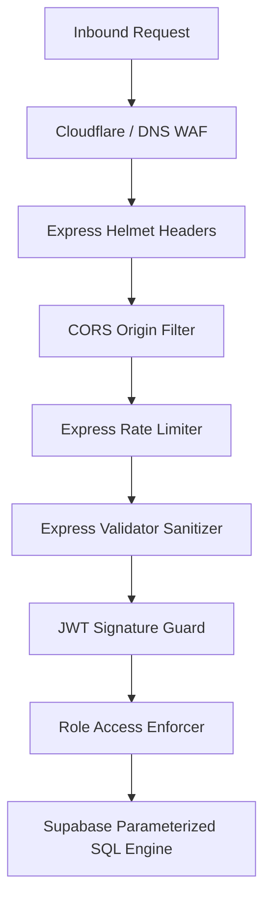

# 17 - Security Design

## Table of Contents
1. [Security Architecture & Governance](#1-security-architecture--governance)
2. [OWASP Top 10 Threat Mitigation Matrix](#2-owasp-top-10-threat-mitigation-matrix)
3. [Network Security, CORS & Helmet Integration](#3-network-security-cors--helmet-integration)
4. [Input Sanitization & Injection Defense](#4-input-sanitization--injection-defense)
5. [Rate Limiting & DDoS Defense](#5-rate-limiting--ddos-defense)
6. [Secrets Management & Environment Hardening](#6-secrets-management--environment-hardening)

---

## 1. Security Architecture & Governance

**LeadDesk AI CRM** enforces defense-in-depth security across all architectural layers. The platform protects customer PII, prevents unauthorized administrative elevation, and maintains resistance against web vulnerabilities.



---

## 2. OWASP Top 10 Threat Mitigation Matrix

| OWASP Vulnerability | Risk Level | LeadDesk AI Mitigation Implementation |
| :--- | :--- | :--- |
| **A01: Broken Access Control** | Critical | Strict RBAC middleware checking token role against resource endpoints. |
| **A02: Cryptographic Failures** | Critical | TLS 1.3 in transit; AES-256 for PostgreSQL storage; 12-round Bcrypt password hashes. |
| **A03: Injection (SQLi / NoSQL)** | High | Supabase client uses 100% parameterized SQL prepared statements. |
| **A04: Insecure Design** | High | Threat-modeled architecture separating public lead ingestion from admin functions. |
| **A05: Security Misconfiguration**| Medium | Helmet middleware stripping `X-Powered-By`; explicit CORS whitelisting. |
| **A06: Vulnerable Components** | Medium | Automated GitHub Dependabot scanning & npm audit checks in CI pipeline. |
| **A07: Identification & Auth** | High | JWT with 24h expiration; Bcrypt salt hashing; brute-force login rate limits. |
| **A08: Software & Data Integrity** | Medium | Immutable database audit logging tracking all record mutations. |
| **A09: Logging Failures** | Medium | Centralized Winston JSON logging capturing IP, user ID, and action events. |
| **A10: Server-Side Request Forgery**| Medium | Strict validation of incoming parameters; zero outbound HTTP calls based on user URLs. |

---

## 3. Network Security, CORS & Helmet Integration

```javascript
// Express Security Configuration
import helmet from 'helmet';
import cors from 'cors';

app.use(helmet()); // Sets Security HTTP Headers (HSTS, Content-Security-Policy, etc.)

app.use(cors({
  origin: process.env.CORS_ORIGIN || 'https://leaddesk-crm.vercel.app',
  methods: ['GET', 'POST', 'PATCH', 'DELETE'],
  allowedHeaders: ['Content-Type', 'Authorization'],
  credentials: true
}));
```

---

## 4. Input Sanitization & Injection Defense

To prevent Cross-Site Scripting (XSS) and injection attacks, all string inputs undergo HTML entity encoding and trim sanitization before storage:

```javascript
import { body } from 'express-validator';

export const validateLeadInput = [
  body('full_name').trim().escape().notEmpty().withMessage('Full name is required'),
  body('email').trim().isEmail().normalizeEmail().withMessage('Valid email required'),
  body('message').trim().escape().notEmpty().withMessage('Message content required')
];
```

---

## 5. Rate Limiting & DDoS Defense

Public ingestion endpoints and login routes are protected against brute-force attacks via `express-rate-limit`:

* **Login Rate Limit**: Maximum 5 login attempts per IP per 15-minute window.
* **Lead Ingestion Rate Limit**: Maximum 20 lead submissions per IP per 15-minute window.

---

## 6. Secrets Management & Environment Hardening

* **Zero Hardcoded Secrets**: Keys (`JWT_SECRET`, `SUPABASE_SERVICE_ROLE_KEY`) are injected at runtime via environment variables.
* **Production Isolation**: Separate development, staging, and production database credentials.

---

## Cross-References
* API Specification: [15-API-Specification.md](file:///C:/Users/PC/.gemini/antigravity/scratch/leaddesk-ai-crm/docs/15-API-Specification.md)
* Auth & RBAC: [16-Authentication-Authorization.md](file:///C:/Users/PC/.gemini/antigravity/scratch/leaddesk-ai-crm/docs/16-Authentication-Authorization.md)
* Validation Rules: [18-Validation-Rules.md](file:///C:/Users/PC/.gemini/antigravity/scratch/leaddesk-ai-crm/docs/18-Validation-Rules.md)
* Logging & Monitoring: [27-Logging-Monitoring.md](file:///C:/Users/PC/.gemini/antigravity/scratch/leaddesk-ai-crm/docs/27-Logging-Monitoring.md)
