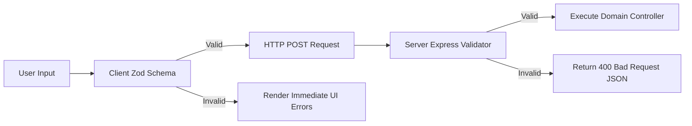

# 18 - Validation Rules

## Table of Contents
1. [Validation Strategy Overview](#1-validation-strategy-overview)
2. [Field-by-Field Validation Matrix](#2-field-by-field-validation-matrix)
3. [Client-Side Zod Validation Schemas](#3-client-side-zod-validation-schemas)
4. [Server-Side Express Validator Specifications](#4-server-side-express-validator-specifications)
5. [Validation Error Mapping & User Feedback](#5-validation-error-mapping--user-feedback)

---

## 1. Validation Strategy Overview

**LeadDesk AI CRM** implements dual-layer input validation across both client (React 19 / Zod) and server (Express Validator) boundaries. This ensures immediate UI responsiveness while guaranteeing that malformed or malicious payloads never compromise database integrity.



---

## 2. Field-by-Field Validation Matrix

| Entity | Field Name | Data Type | Required | Bounds / Format | Validation Rule Description | Error Message |
| :--- | :--- | :--- | :--- | :--- | :--- | :--- |
| **Lead** | `full_name` | String | Yes | 2 – 150 chars | Trimmed, alphabetic + spaces/hyphens | "Full name must be between 2 and 150 characters" |
| **Lead** | `email` | String | Yes | Valid RFC 5322 | Valid email format, lowercase normalized | "Please enter a valid email address" |
| **Lead** | `phone` | String | No | 7 – 20 chars | International phone number regex | "Invalid phone number format" |
| **Lead** | `company` | String | No | Max 150 chars | Trimmed string | "Company name cannot exceed 150 characters" |
| **Lead** | `budget` | Numeric | Yes | 0 – 10,000,000 | Non-negative numeric format | "Budget must be a valid positive number" |
| **Lead** | `message` | String | Yes | 10 – 2000 chars | Non-empty string detailing inquiry | "Message must be between 10 and 2000 characters" |
| **User** | `email` | String | Yes | Valid Email | Corporate domain email format | "Please enter a valid user login email" |
| **User** | `password` | String | Yes | Min 8 chars | Must contain upper, lower, number, special char | "Password must contain at least 8 characters, 1 number, and 1 special char" |

---

## 3. Client-Side Zod Validation Schemas

```typescript
import { z } from 'zod';

export const CreateLeadSchema = z.object({
  full_name: z.string().min(2, 'Full name must be at least 2 characters').max(150),
  email: z.string().email('Please enter a valid email address'),
  phone: z.string().optional(),
  company: z.string().max(150).optional(),
  budget: z.number({ invalid_type_error: 'Budget must be a valid number' }).min(0, 'Budget cannot be negative'),
  message: z.string().min(10, 'Inquiry message must be at least 10 characters').max(2000)
});
```

---

## 4. Server-Side Express Validator Specifications

```javascript
import { body, validationResult } from 'express-validator';

export const leadValidationRules = () => [
  body('full_name').trim().isLength({ min: 2, max: 150 }).withMessage('Full name must be 2-150 characters'),
  body('email').trim().isEmail().normalizeEmail().withMessage('Valid email required'),
  body('budget').isNumeric().custom(value => value >= 0).withMessage('Budget must be >= 0'),
  body('message').trim().isLength({ min: 10, max: 2000 }).withMessage('Message must be 10-2000 characters')
];

export const validate = (req, res, next) => {
  const errors = validationResult(req);
  if (errors.isEmpty()) return next();

  return res.status(400).json({
    success: false,
    error: {
      code: 'INVALID_INPUT',
      message: 'Field validation failed',
      details: errors.array().map(err => ({ field: err.param, message: err.msg }))
    }
  });
};
```

---

## 5. Validation Error Mapping & User Feedback

1. **Inline Field Errors**: React Hook Form maps Zod schema validation errors directly to the corresponding UI form inputs.
2. **Global Alert Toasts**: Unhandled server validation errors trigger top-right alert toasts.

---

## Cross-References
* API Specification: [15-API-Specification.md](file:///C:/Users/PC/.gemini/antigravity/scratch/leaddesk-ai-crm/docs/15-API-Specification.md)
* Security Design: [17-Security-Design.md](file:///C:/Users/PC/.gemini/antigravity/scratch/leaddesk-ai-crm/docs/17-Security-Design.md)
* Business Rules: [19-Business-Rules.md](file:///C:/Users/PC/.gemini/antigravity/scratch/leaddesk-ai-crm/docs/19-Business-Rules.md)
* Frontend Architecture: [20-Frontend-Architecture.md](file:///C:/Users/PC/.gemini/antigravity/scratch/leaddesk-ai-crm/docs/20-Frontend-Architecture.md)
