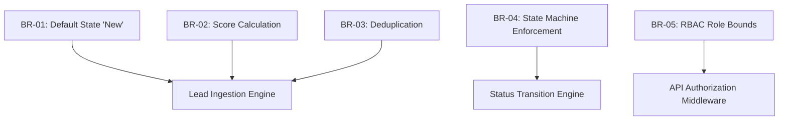
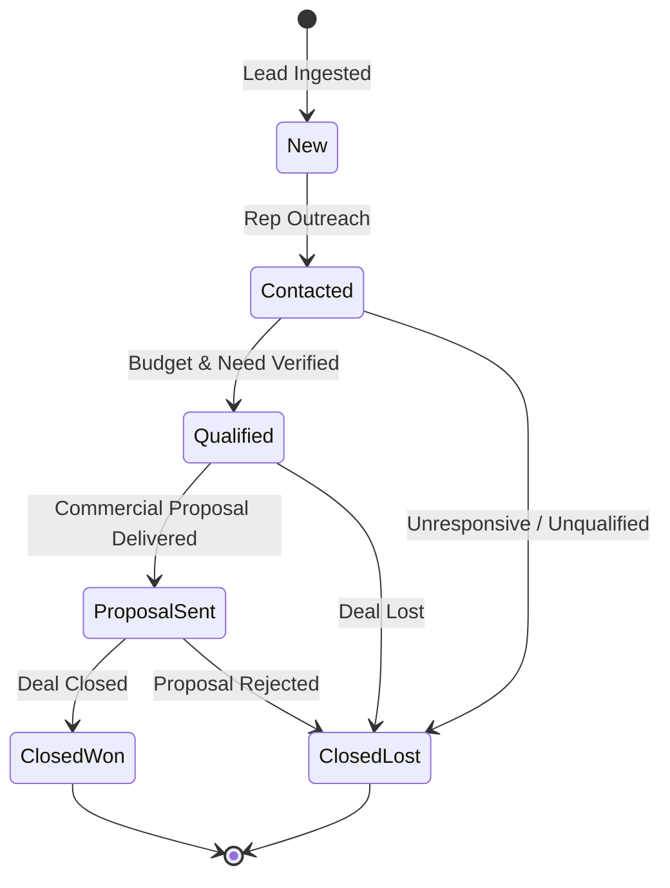

# 19 - Business Rules

## Table of Contents
1. [Business Rules Overview](#1-business-rules-overview)
2. [Domain Policy Catalog](#2-domain-policy-catalog)
3. [Lead Lifecycle State Machine Rules](#3-lead-lifecycle-state-machine-rules)
4. [AI Intent & Score Threshold Matrix](#4-ai-intent--score-threshold-matrix)
5. [Deduplication & Ingestion Rules](#5-deduplication--ingestion-rules)
6. [Access Control & Visibility Enforcement](#6-access-control--visibility-enforcement)

---

## 1. Business Rules Overview

This document specifies the operational logic, state machines, scoring matrices, deduplication algorithms, and access policies governing **LeadDesk AI CRM**.

---

## 2. Domain Policy Catalog

---

## 3. Lead Lifecycle State Machine Rules

The status of a lead must conform to the state transitions defined below:

### Transition Enforcement Rules:
* **RULE-SM-01**: Every newly ingested lead MUST default to status `New`.
* **RULE-SM-02**: Leads in terminal states (`Closed Won`, `Closed Lost`) CANNOT be transitioned back to `New`.
* **RULE-SM-03**: Only Sales Managers and Super Admins can transition a lead out of `Closed Lost`.

---

## 4. AI Intent & Score Threshold Matrix

Lead score calculation executes immediately upon ingestion using the formula:
$$\text{Score} = S_{\text{budget}} + S_{\text{domain}} + S_{\text{intent}}$$

| Evaluation Criteria | Condition | Point Value |
| :--- | :--- | :--- |
| **Budget Threshold** | $\text{Budget} \ge \$50,000$ | +40 Points |
| **Budget Threshold** | $\$10,000 \le \text{Budget} < \$50,000$ | +25 Points |
| **Budget Threshold** | $\text{Budget} < \$10,000$ | +10 Points |
| **Email Domain** | Custom Corporate Domain (e.g. `@acmecorp.com`) | +30 Points |
| **Email Domain** | Generic Provider (e.g. `@gmail.com`, `@yahoo.com`) | +10 Points |
| **Message Intent** | High-intent keywords ("Enterprise", "Demo", "Pricing") | +30 Points |
| **Message Intent** | Standard Inquiry | +15 Points |

### Score Tier Classification:
* **HOT Tier**: Score $\ge 70$ (Requires immediate touchpoint within 15 mins)
* **WARM Tier**: $40 \le \text{Score} \le 69$ (Standard response within 4 hours)
* **COLD Tier**: Score $< 40$ (Nurture email sequence queue)

---

## 5. Deduplication & Ingestion Rules

* **RULE-DEDUP-01**: If an inbound lead email matches an existing active lead created within the last 24 hours, the submission is flagged as a `Duplicate` and attached as a note rather than creating a new lead entity.

---

## 6. Access Control & Visibility Enforcement

* **RULE-RBAC-01**: Sales Representatives can only view and edit leads explicitly assigned to them or unassigned leads in the public pool.
* **RULE-RBAC-02**: Sales Managers and Super Admins have complete visibility across all team leads and analytics dashboards.

---

## Cross-References
* PRD Specifications: [04-Product-Requirements-Document.md](file:///C:/Users/PC/.gemini/antigravity/scratch/leaddesk-ai-crm/docs/04-Product-Requirements-Document.md)
* Functional Requirements: [05-Functional-Requirements.md](file:///C:/Users/PC/.gemini/antigravity/scratch/leaddesk-ai-crm/docs/05-Functional-Requirements.md)
* API Specification: [15-API-Specification.md](file:///C:/Users/PC/.gemini/antigravity/scratch/leaddesk-ai-crm/docs/15-API-Specification.md)
* Validation Rules: [18-Validation-Rules.md](file:///C:/Users/PC/.gemini/antigravity/scratch/leaddesk-ai-crm/docs/18-Validation-Rules.md)
