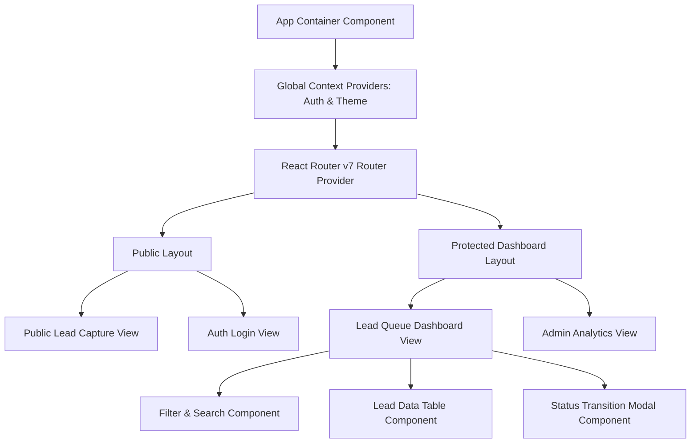

# 20 - Frontend Architecture

## Table of Contents
1. [Frontend Architecture Overview](#1-frontend-architecture-overview)
2. [Component Tree & Layout Structure](#2-component-tree--layout-structure)
3. [Routing Strategy with React Router v7](#3-routing-strategy-with-react-router-v7)
4. [API Client Layer & Axios Interceptors](#4-api-client-layer--axios-interceptors)
5. [Form Architecture with React Hook Form & Zod](#5-form-architecture-with-react-hook-form--zod)
6. [Performance & Code-Splitting Strategy](#6-performance--code-splitting-strategy)

---

## 1. Frontend Architecture Overview

The **LeadDesk AI CRM** frontend is built using **React 19** bundled with **Vite** and styled using **Tailwind CSS**. It follows a modular, feature-first container/presentational component architecture designed for responsiveness, accessibility, and sub-second rendering speeds.



---

## 2. Component Tree & Layout Structure

### 1. Public Layout:
* Minimalist header with branding.
* Full-width responsive container for lead submission and authentication forms.

### 2. Protected Dashboard Layout:
* Top Navigation Bar (User info, Role badge, Search bar, Quick stats, Logout trigger).
* Main Viewport (Dynamic leads data table, filter controls, pagination bar).
* Slide-over Drawer / Modal (Detailed lead view, activity history, notes editor).

---

## 3. Routing Strategy with React Router v7

Client-side routing utilizes React Router v7 declarative route guards:

```jsx
import { createBrowserRouter, RouterProvider, Navigate } from 'react-router-dom';

const router = createBrowserRouter([
  {
    path: '/',
    element: <PublicLayout />,
    children: [
      { index: true, element: <PublicLeadFormView /> },
      { path: 'login', element: <LoginView /> }
    ]
  },
  {
    path: '/dashboard',
    element: <ProtectedRoute><DashboardLayout /></ProtectedRoute>,
    children: [
      { index: true, element: <LeadQueueView /> },
      { path: 'analytics', element: <RoleGuard role="sales_manager"><AnalyticsView /></RoleGuard> }
    ]
  }
]);
```

---

## 4. API Client Layer & Axios Interceptors

All HTTP requests pass through a centralized Axios singleton that automatically attaches JWT tokens and handles global errors:

```javascript
import axios from 'axios';

const apiClient = axios.create({
  baseURL: import.meta.env.VITE_API_BASE_URL || '/api/v1',
  timeout: 10000,
  headers: { 'Content-Type': 'application/json' }
});

apiClient.interceptors.request.use((config) => {
  const token = sessionStorage.getItem('token');
  if (token) {
    config.headers.Authorization = `Bearer ${token}`;
  }
  return config;
});
```

---

## 5. Form Architecture with React Hook Form & Zod

Forms leverage `@hookform/resolvers/zod` to connect Zod schemas directly with React Hook Form controllers, minimizing re-renders and guaranteeing type safety.

---

## 6. Performance & Code-Splitting Strategy

* **Route-Based Lazy Loading**: All top-level page views are dynamically imported using `React.lazy()` and wrapped in `<React.Suspense fallback={<LoadingSpinner />}>`.
* **Asset Optimization**: Vite splits vendor chunks (`react`, `axios`, `lucide-react`) for long-term browser caching.

---

## Cross-References
* Tech Stack: [08-Technology-Stack.md](file:///C:/Users/PC/.gemini/antigravity/scratch/leaddesk-ai-crm/docs/08-Technology-Stack.md)
* Design System: [22-Design-System.md](file:///C:/Users/PC/.gemini/antigravity/scratch/leaddesk-ai-crm/docs/22-Design-System.md)
* UI/UX Guidelines: [23-UI-UX-Guidelines.md](file:///C:/Users/PC/.gemini/antigravity/scratch/leaddesk-ai-crm/docs/23-UI-UX-Guidelines.md)
* State Management: [25-State-Management.md](file:///C:/Users/PC/.gemini/antigravity/scratch/leaddesk-ai-crm/docs/25-State-Management.md)
