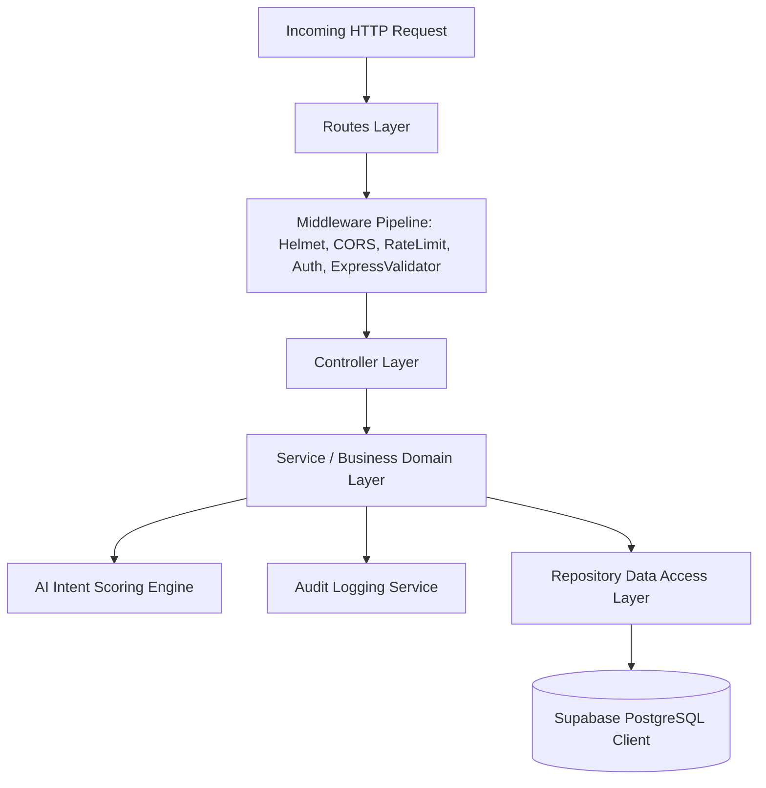

# 21 - Backend Architecture

## Table of Contents
1. [Backend Architecture Overview](#1-backend-architecture-overview)
2. [Layered Architecture Pattern](#2-layered-architecture-pattern)
3. [Express Application Bootstrapping](#3-express-application-bootstrapping)
4. [Middleware Stack Order](#4-middleware-stack-order)
5. [Service & Repository Implementation](#5-service--repository-implementation)
6. [Global Exception & Async Handling](#6-global-exception--async-handling)

---

## 1. Backend Architecture Overview

The **LeadDesk AI CRM** backend is constructed as a modern, layered Node.js application using **Express.js**. The architecture isolates HTTP request handling, input validation, business domain rules, AI scoring algorithms, and SQL persistence layers into dedicated modules.



---

## 2. Layered Architecture Pattern

| Layer | Primary Responsibility | Key Modules |
| :--- | :--- | :--- |
| **Routes Layer** | Map HTTP verbs and URIs to middleware stacks and controllers. | `authRoutes.js`, `leadRoutes.js`, `analyticsRoutes.js` |
| **Middleware Layer** | Security, rate limiting, authentication, payload validation. | `authMiddleware.js`, `rateLimiter.js`, `validator.js` |
| **Controller Layer** | Parse HTTP params, invoke domain services, send HTTP responses. | `authController.js`, `leadController.js` |
| **Service Layer** | Implement core business rules, calculate scores, control state. | `leadService.js`, `scoringEngine.js`, `auditService.js` |
| **Repository Layer** | Encapsulate SQL queries and Supabase database interactions. | `leadRepository.js`, `userRepository.js` |

---

## 3. Express Application Bootstrapping

```javascript
// server.js - Express Engine Entrypoint
import express from 'express';
import helmet from 'helmet';
import cors from 'cors';
import { leadRoutes } from './routes/leadRoutes.js';
import { authRoutes } from './routes/authRoutes.js';
import { errorHandler } from './middlewares/errorHandler.js';

const app = express();

app.use(helmet());
app.use(cors());
app.use(express.json());

// API Routes
app.use('/api/v1/auth', authRoutes);
app.use('/api/v1/leads', leadRoutes);

// Global Error Middleware
app.use(errorHandler);

const PORT = process.env.PORT || 5000;
app.listen(PORT, () => console.log(`Server listening on port ${PORT}`));
```

---

## 4. Middleware Stack Order

1. **`helmet()`**: Injects HTTP security headers.
2. **`cors()`**: Validates incoming origin headers.
3. **`express.json()`**: Parses incoming JSON bodies.
4. **`rateLimiter()`**: Enforces per-IP request quotas.
5. **`expressValidator()`**: Sanitizes and validates field formatting.
6. **`authenticateJWT()`**: Decodes and verifies bearer token signatures.
7. **`authorizeRoles()`**: Confirms RBAC permissions.

---

## 5. Service & Repository Implementation

Business logic is completely isolated from HTTP concerns inside services:

```javascript
// services/leadService.js
export class LeadService {
  constructor(leadRepo, scoringEngine, auditService) {
    this.leadRepo = leadRepo;
    this.scoringEngine = scoringEngine;
    this.auditService = auditService;
  }

  async ingestLead(leadDTO) {
    const { score, tier } = this.scoringEngine.evaluate(leadDTO);
    const leadRecord = await this.leadRepo.create({ ...leadDTO, score_value: score, score_tier: tier });
    await this.auditService.log({ action: 'LEAD_CREATED', lead_id: leadRecord.id });
    return leadRecord;
  }
}
```

---

## 6. Global Exception & Async Handling

All controllers wrap asynchronous calls using a custom `asyncHandler` wrapper to eliminate repetitive try-catch blocks and automatically route unhandled promise rejections to the global error middleware.

---

## Cross-References
* Tech Stack: [08-Technology-Stack.md](file:///C:/Users/PC/.gemini/antigravity/scratch/leaddesk-ai-crm/docs/08-Technology-Stack.md)
* Database Design: [09-Database-Design.md](file:///C:/Users/PC/.gemini/antigravity/scratch/leaddesk-ai-crm/docs/09-Database-Design.md)
* Security Design: [17-Security-Design.md](file:///C:/Users/PC/.gemini/antigravity/scratch/leaddesk-ai-crm/docs/17-Security-Design.md)
* Error Handling: [26-Error-Handling.md](file:///C:/Users/PC/.gemini/antigravity/scratch/leaddesk-ai-crm/docs/26-Error-Handling.md)
