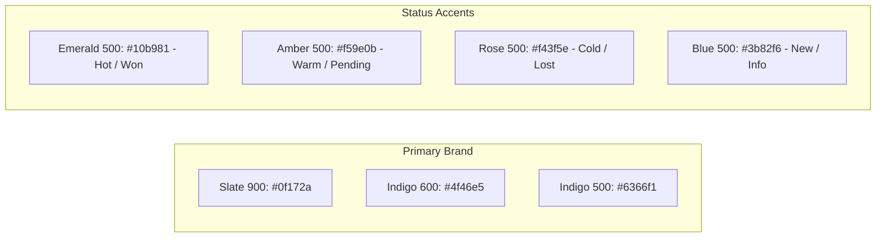

# 22 - Design System

## Table of Contents
1. [Design System Overview & Principles](#1-design-system-overview--principles)
2. [Color Palette & Semantic Tokens](#2-color-palette--semantic-tokens)
3. [Typography Hierarchy](#3-typography-hierarchy)
4. [Spacing & Grid Systems](#4-spacing--grid-systems)
5. [Component Token Library](#5-component-token-library)
6. [Status Badge Tokens](#6-status-badge-tokens)
7. [Accessibility & Contrast Ratios](#7-accessibility--contrast-ratios)

---

## 1. Design System Overview & Principles

The **LeadDesk AI CRM** Design System provides a cohesive visual language and component framework built using **Tailwind CSS**. Designed for modern, high-density enterprise SaaS applications, it prioritizes legibility, high contrast, responsive adaptability, and subtle micro-interactions.

---

## 2. Color Palette & Semantic Tokens



### Color Specification Matrix:

| Token Name | Hex Code | Tailwind Class | Functional Purpose |
| :--- | :--- | :--- | :--- |
| `--color-bg-app` | `#0f172a` | `bg-slate-900` | Primary dark app viewport background |
| `--color-bg-card` | `#1e293b` | `bg-slate-800` | Card container, table header, modal background |
| `--color-border` | `#334155` | `border-slate-700` | Component outline and table divider lines |
| `--color-text-primary` | `#f8fafc` | `text-slate-50` | Primary headings, table text, high-emphasis text |
| `--color-text-muted` | `#94a3b8` | `text-slate-400` | Subtitles, labels, disabled placeholder text |
| `--color-brand` | `#6366f1` | `bg-indigo-500` | Main CTA buttons, active state indicators |
| `--color-success` | `#10b981` | `bg-emerald-500` | Success toasts, `Hot` tier badges, `Closed Won` |
| `--color-warning` | `#f59e0b` | `bg-amber-500` | `Warm` tier badges, `Proposal Sent` status |
| `--color-danger` | `#f43f5e` | `bg-rose-500` | Error messages, `Cold` tier badges, `Closed Lost` |

---

## 3. Typography Hierarchy

Primary Font Stack: **Inter**, system-ui, sans-serif.

| Level | Size / Line-Height | Weight | Tailwind Classes | Usage |
| :--- | :--- | :--- | :--- | :--- |
| **Heading 1** | 2.25rem (36px) / 2.5rem | Bold (700) | `text-3xl font-bold text-slate-50` | Landing Page Hero |
| **Heading 2** | 1.5rem (24px) / 2.0rem | SemiBold (600) | `text-2xl font-semibold text-slate-50` | Dashboard Section Titles |
| **Heading 3** | 1.125rem (18px) / 1.75rem | Medium (500) | `text-lg font-medium text-slate-200` | Card & Modal Titles |
| **Body Large** | 1.0rem (16px) / 1.5rem | Normal (400) | `text-base text-slate-300` | Form Input Text, Lead Notes |
| **Body Small** | 0.875rem (14px) / 1.25rem | Normal (400) | `text-sm text-slate-400` | Data Table Cells, Table Headers |
| **Caption** | 0.75rem (12px) / 1.0rem | Medium (500) | `text-xs font-medium text-slate-400` | Status Badges, Timestamp Labels |

---

## 4. Spacing & Grid Systems

The layout enforces a 4px / 8px incremental baseline grid system:
* `p-2` (8px), `p-4` (16px), `p-6` (24px), `p-8` (32px).
* **Grid**: 12-column responsive layout container with `gap-6`.

---

## 5. Component Token Library

### Primary Action Button (`CTA`):
```html
<button class="inline-flex items-center justify-center px-4 py-2 bg-indigo-600 hover:bg-indigo-500 text-white font-medium text-sm rounded-lg shadow-sm focus:outline-none focus:ring-2 focus:ring-indigo-400 focus:ring-offset-2 focus:ring-offset-slate-900 transition-all duration-150">
  Submit Request
</button>
```

---

## 6. Status Badge Tokens

```html
<!-- Hot / Won Badge -->
<span class="inline-flex items-center px-2.5 py-0.5 rounded-full text-xs font-medium bg-emerald-500/10 text-emerald-400 border border-emerald-500/20">
  Hot (90)
</span>

<!-- Warm Badge -->
<span class="inline-flex items-center px-2.5 py-0.5 rounded-full text-xs font-medium bg-amber-500/10 text-amber-400 border border-amber-500/20">
  Warm (55)
</span>
```

---

## 7. Accessibility & Contrast Ratios

All text-to-background combinations meet or exceed the WCAG 2.1 AA minimum contrast requirement of 4.5:1 for normal text and 3:1 for large text.

---

## Cross-References
* Frontend Architecture: [20-Frontend-Architecture.md](file:///C:/Users/PC/.gemini/antigravity/scratch/leaddesk-ai-crm/docs/20-Frontend-Architecture.md)
* UI/UX Guidelines: [23-UI-UX-Guidelines.md](file:///C:/Users/PC/.gemini/antigravity/scratch/leaddesk-ai-crm/docs/23-UI-UX-Guidelines.md)
* State Management: [25-State-Management.md](file:///C:/Users/PC/.gemini/antigravity/scratch/leaddesk-ai-crm/docs/25-State-Management.md)
