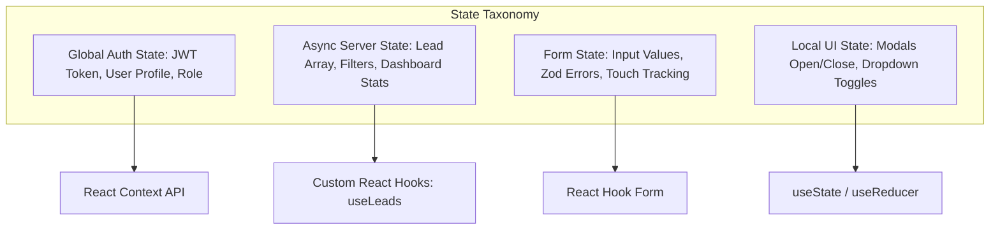

# 25 - State Management

## Table of Contents
1. [State Management Taxonomy](#1-state-management-taxonomy)
2. [Global Authentication State (React Context API)](#2-global-authentication-state-react-context-api)
3. [Form State Management (React Hook Form)](#3-form-state-management-react-hook-form)
4. [Async Server State & Filtering Hooks](#4-async-server-state--filtering-hooks)
5. [Optimistic UI State Updates & Error Rollbacks](#5-optimistic-ui-state-updates--error-rollbacks)

---

## 1. State Management Taxonomy

**LeadDesk AI CRM** categorizes state into four explicit tiers to prevent unnecessary component re-renders and maintain state predictability:



---

## 2. Global Authentication State (React Context API)

Global session state is stored in `AuthContext` to provide secure authentication access across protected routes:

```jsx
import { createContext, useContext, useState, useEffect } from 'react';

const AuthContext = createContext(null);

export const AuthProvider = ({ children }) => {
  const [user, setUser] = useState(null);
  const [token, setToken] = useState(sessionStorage.getItem('token') || null);
  const [loading, setLoading] = useState(true);

  const login = (userData, jwtToken) => {
    setUser(userData);
    setToken(jwtToken);
    sessionStorage.setItem('token', jwtToken);
  };

  const logout = () => {
    setUser(null);
    setToken(null);
    sessionStorage.removeItem('token');
  };

  return (
    <AuthContext.Provider value={{ user, token, login, logout, loading }}>
      {children}
    </AuthContext.Provider>
  );
};

export const useAuth = () => useContext(AuthContext);
```

---

## 3. Form State Management (React Hook Form)

Transient input fields during lead ingestion or user login are managed using `React Hook Form`. By keeping form inputs uncontrolled until submission, typing in form inputs causes zero re-renders of parent container components.

---

## 4. Async Server State & Filtering Hooks

The custom `useLeads` hook manages API communication, search query debouncing, status filtering, and pagination:

```javascript
export const useLeads = (initialFilters = {}) => {
  const [leads, setLeads] = useState([]);
  const [loading, setLoading] = useState(false);
  const [filters, setFilters] = useState(initialFilters);

  const fetchLeads = useCallback(async () => {
    setLoading(true);
    try {
      const response = await apiClient.get('/leads', { params: filters });
      setLeads(response.data.data);
    } catch (err) {
      console.error('Failed to fetch leads', err);
    } finally {
      setLoading(false);
    }
  }, [filters]);

  useEffect(() => { fetchLeads(); }, [fetchLeads]);

  return { leads, setLeads, loading, filters, setFilters, refetch: fetchLeads };
};
```

---

## 5. Optimistic UI State Updates & Error Rollbacks

When a sales representative changes a lead status:
1. The UI instantly updates the local lead array row color and badge text.
2. An asynchronous HTTP `PATCH` request is dispatched to the backend.
3. If the backend request fails (e.g. network timeout), the UI catches the error, reverts the badge back to its previous state, and renders a red error toast.

---

## Cross-References
* Frontend Architecture: [20-Frontend-Architecture.md](file:///C:/Users/PC/.gemini/antigravity/scratch/leaddesk-ai-crm/docs/20-Frontend-Architecture.md)
* UI/UX Guidelines: [23-UI-UX-Guidelines.md](file:///C:/Users/PC/.gemini/antigravity/scratch/leaddesk-ai-crm/docs/23-UI-UX-Guidelines.md)
* Error Handling: [26-Error-Handling.md](file:///C:/Users/PC/.gemini/antigravity/scratch/leaddesk-ai-crm/docs/26-Error-Handling.md)
