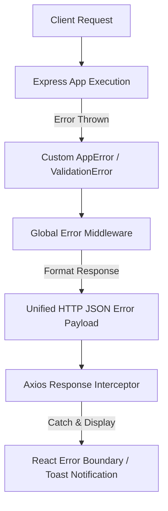

# 26 - Error Handling

## Table of Contents
1. [Error Handling Architecture](#1-error-handling-architecture)
2. [Custom Error Class Hierarchy](#2-custom-error-class-hierarchy)
3. [Express Global Error Middleware](#3-express-global-error-middleware)
4. [React Error Boundaries & Fallback UI](#4-react-error-boundaries--fallback-ui)
5. [Client-Side Axios Error Handling Interceptor](#5-client-side-axios-error-handling-interceptor)

---

## 1. Error Handling Architecture

**LeadDesk AI CRM** implements end-to-end exception management that guarantees graceful failure recovery, prevents application crashes, isolates stack traces from production responses, and delivers clear actionable messages to end users.



---

## 2. Custom Error Class Hierarchy

```javascript
// utils/errors.js - Base Application Error
export class AppError extends Error {
  constructor(message, statusCode = 500, code = 'INTERNAL_ERROR', details = []) {
    super(message);
    this.statusCode = statusCode;
    this.code = code;
    this.details = details;
    this.isOperational = true;
  }
}

export class ValidationError extends AppError {
  constructor(message = 'Validation failed', details = []) {
    super(message, 400, 'INVALID_INPUT', details);
  }
}

export class UnauthorizedError extends AppError {
  constructor(message = 'Authentication required') {
    super(message, 401, 'UNAUTHORIZED');
  }
}

export class ForbiddenError extends AppError {
  constructor(message = 'Access forbidden') {
    super(message, 403, 'FORBIDDEN');
  }
}
```

---

## 3. Express Global Error Middleware

```javascript
// middlewares/errorHandler.js
export const errorHandler = (err, req, res, next) => {
  const statusCode = err.statusCode || 500;
  const code = err.code || 'SERVER_ERROR';

  console.error(`[ERROR] ${req.method} ${req.url}:`, err);

  res.status(statusCode).json({
    success: false,
    error: {
      code,
      message: err.message || 'An unexpected server error occurred',
      details: err.details || []
    },
    timestamp: new Date().toISOString()
  });
};
```

---

## 4. React Error Boundaries & Fallback UI

A top-level React Error Boundary wraps the dashboard UI. If an unhandled client component exception occurs, the Error Boundary catches the stack, prevents screen blanking, and renders a fallback view with a single-click "Reload View" button.

---

## 5. Client-Side Axios Error Handling Interceptor

```javascript
apiClient.interceptors.response.use(
  (response) => response,
  (error) => {
    if (error.response?.status === 401) {
      sessionStorage.removeItem('token');
      window.location.href = '/login?expired=true';
    }
    const errorMessage = error.response?.data?.error?.message || 'Network error occurred';
    toast.error(errorMessage);
    return Promise.reject(error);
  }
);
```

---

## Cross-References
* API Specification: [15-API-Specification.md](file:///C:/Users/PC/.gemini/antigravity/scratch/leaddesk-ai-crm/docs/15-API-Specification.md)
* Backend Architecture: [21-Backend-Architecture.md](file:///C:/Users/PC/.gemini/antigravity/scratch/leaddesk-ai-crm/docs/21-Backend-Architecture.md)
* Logging & Monitoring: [27-Logging-Monitoring.md](file:///C:/Users/PC/.gemini/antigravity/scratch/leaddesk-ai-crm/docs/27-Logging-Monitoring.md)
