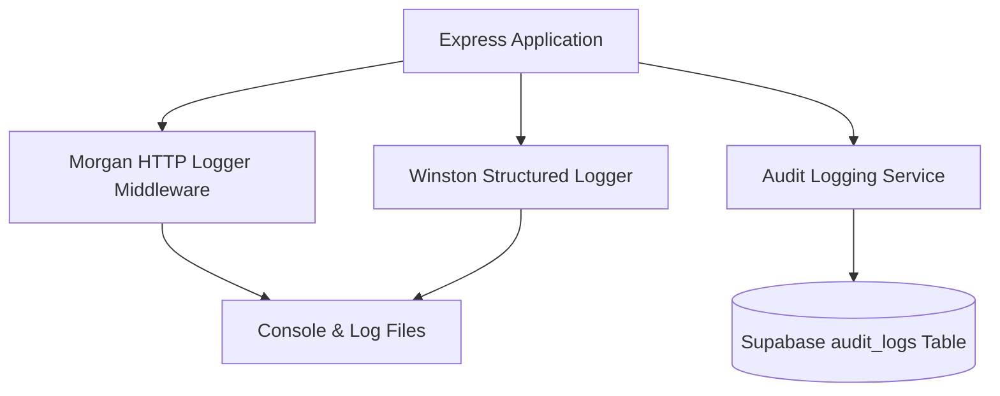

# 27 - Logging & Monitoring

## Table of Contents
1. [Telemetry & Logging Architecture](#1-telemetry--logging-architecture)
2. [Structured Log Schema Specifications](#2-structured-log-schema-specifications)
3. [Winston Logger Implementation](#3-winston-logger-implementation)
4. [HTTP Request Logging with Morgan](#4-http-request-logging-with-morgan)
5. [Health Checks & Uptime Monitoring](#5-health-checks--uptime-monitoring)
6. [Audit Trail Emission](#6-audit-trail-emission)

---

## 1. Telemetry & Logging Architecture

**LeadDesk AI CRM** incorporates a structured JSON logging strategy designed for observability, quick diagnosis, and operational auditing across development and cloud environments.



---

## 2. Structured Log Schema Specifications

All log entries are emitted as structured JSON objects containing standard fields:

```json
{
  "timestamp": "2026-07-25T12:30:00.123Z",
  "level": "info",
  "message": "Lead ingested successfully",
  "context": {
    "lead_id": "9b1deb4d-3b7d-4bad-9bdd-2b0d7b3dcb6d",
    "score_tier": "Hot",
    "ip_address": "192.168.1.1",
    "duration_ms": 42
  }
}
```

### Log Levels:
* **`error`**: Critical system failures, unhandled exceptions, database loss.
* **`warn`**: Rate limit triggers, validation rejections, soft failures.
* **`info`**: Successful authentication, lead ingestion, state transitions.
* **`debug`**: Verbose SQL query parameters and internal execution details.

---

## 3. Winston Logger Implementation

```javascript
import winston from 'winston';

export const logger = winston.createLogger({
  level: process.env.LOG_LEVEL || 'info',
  format: winston.format.combine(
    winston.format.timestamp(),
    winston.format.json()
  ),
  transports: [
    new winston.transports.Console(),
    new winston.transports.File({ filename: 'logs/error.log', level: 'error' }),
    new winston.transports.File({ filename: 'logs/combined.log' })
  ]
});
```

---

## 4. HTTP Request Logging with Morgan

Express utilizes `morgan` configured to pipe HTTP access logs through Winston:

```javascript
import morgan from 'morgan';
import { logger } from './logger.js';

export const httpLogger = morgan(':method :url :status :res[content-length] - :response-time ms', {
  stream: { write: (message) => logger.info(message.trim()) }
});
```

---

## 5. Health Checks & Uptime Monitoring

System health is exposed via `GET /api/v1/health`:

```json
{
  "status": "UP",
  "uptime_seconds": 86400,
  "database": "CONNECTED",
  "timestamp": "2026-07-25T12:35:00.000Z"
}
```

---

## 6. Audit Trail Emission

Every state modification dispatches an asynchronous audit log event to the `audit_logs` database table, capturing the actor ID, target lead ID, previous JSON state snapshot, new JSON state snapshot, and timestamp.

---

## Cross-References
* Security Design: [17-Security-Design.md](file:///C:/Users/PC/.gemini/antigravity/scratch/leaddesk-ai-crm/docs/17-Security-Design.md)
* Backend Architecture: [21-Backend-Architecture.md](file:///C:/Users/PC/.gemini/antigravity/scratch/leaddesk-ai-crm/docs/21-Backend-Architecture.md)
* Error Handling: [26-Error-Handling.md](file:///C:/Users/PC/.gemini/antigravity/scratch/leaddesk-ai-crm/docs/26-Error-Handling.md)
