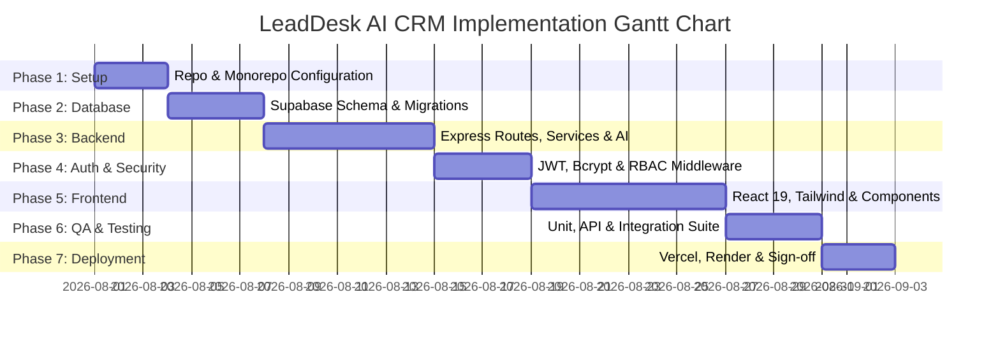

# 31 - Implementation Plan

## Table of Contents
1. [Project Execution Roadmap](#1-project-execution-roadmap)
2. [Phase 1: Environment & Project Setup](#2-phase-1-environment--project-setup)
3. [Phase 2: Database Schema & Migration Implementation](#3-phase-2-database-schema--migration-implementation)
4. [Phase 3: Backend API & Core Business Services](#4-phase-3-backend-api--core-business-services)
5. [Phase 4: Authentication, Security & RBAC Implementation](#5-phase-4-authentication-security--rbac-implementation)
6. [Phase 5: Frontend React 19 UI & Design System](#6-phase-5-frontend-react-19-ui--design-system)
7. [Phase 6: Integration, E2E Testing & Verification](#7-phase-6-integration-e2e-testing--verification)
8. [Phase 7: Cloud Deployment & Production Sign-off](#8-phase-7-cloud-deployment--production-sign-off)

---

## 1. Project Execution Roadmap

This document outlines the multi-sprint implementation plan for building and deploying **LeadDesk AI CRM**.

---

## 2. Phase 1: Environment & Project Setup

* **Deliverables**: Monorepo root directory structure, Git configuration, ESLint/Prettier rules.
* **Target Duration**: 3 Days.

---

## 3. Phase 2: Database Schema & Migration Implementation

* **Deliverables**: Supabase PostgreSQL project initialization, DDL execution (`users`, `leads`, `lead_notes`, `audit_logs`), indexes, triggers.
* **Target Duration**: 4 Days.

---

## 4. Phase 3: Backend API & Core Business Services

* **Deliverables**: Express.js engine setup, lead ingestion endpoint (`POST /api/v1/leads`), AI intent scoring engine, audit logging service.
* **Target Duration**: 7 Days.

---

## 5. Phase 4: Authentication, Security & RBAC Implementation

* **Deliverables**: User login endpoint (`POST /api/v1/auth/login`), JWT signing, Bcrypt password comparison, RBAC middleware.
* **Target Duration**: 4 Days.

---

## 6. Phase 5: Frontend React 19 UI & Design System

* **Deliverables**: Tailwind CSS design tokens, Public Lead Form (Zod), Sales Rep Lead Dashboard Table, Status Transition Modals.
* **Target Duration**: 8 Days.

---

## 7. Phase 6: Integration, E2E Testing & Verification

* **Deliverables**: Vitest unit test coverage (>85%), Supertest API integration suites, Playwright E2E verification scripts.
* **Target Duration**: 4 Days.

---

## 8. Phase 7: Cloud Deployment & Production Sign-off

* **Deliverables**: Deploying frontend to Vercel CDN Edge, deploying backend to Render container runtime, post-deployment smoke validation.
* **Target Duration**: 3 Days.

---

## Cross-References
* Architecture: [07-System-Architecture.md](file:///C:/Users/PC/.gemini/antigravity/scratch/leaddesk-ai-crm/docs/07-System-Architecture.md)
* Deployment Guide: [33-Deployment-Guide.md](file:///C:/Users/PC/.gemini/antigravity/scratch/leaddesk-ai-crm/docs/33-Deployment-Guide.md)
* Developer Handbook: [34-Developer-Handbook.md](file:///C:/Users/PC/.gemini/antigravity/scratch/leaddesk-ai-crm/docs/34-Developer-Handbook.md)
