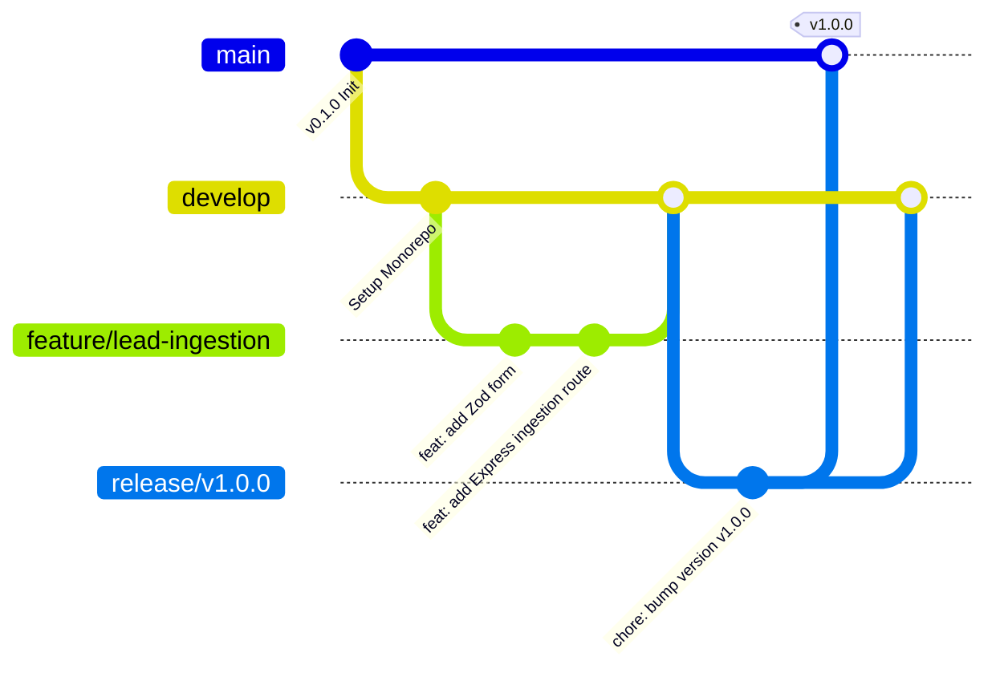

# 32 - Git Workflow

## Table of Contents
1. [Git Branching Strategy (GitFlow Variant)](#1-git-branching-strategy-gitflow-variant)
2. [Branch Taxonomy & Naming Conventions](#2-branch-taxonomy--naming-conventions)
3. [Conventional Commit Standards](#3-conventional-commit-standards)
4. [Pull Request (PR) & Code Review Guidelines](#4-pull-request-pr--code-review-guidelines)
5. [Release & Semantic Versioning Rules](#5-release--semantic-versioning-rules)

---

## 1. Git Branching Strategy (GitFlow Variant)

**LeadDesk AI CRM** enforces a strict GitFlow branching strategy to maintain trunk stability and ensure zero broken builds in production.

---

## 2. Branch Taxonomy & Naming Conventions

* `main`: Production-ready source code. Protected branch.
* `develop`: Active integration branch for upcoming releases.
* `feature/<feature-name>`: Feature branch created from `develop` (e.g., `feature/ai-scoring-engine`).
* `bugfix/<bug-name>`: Non-urgent bug fix created from `develop` (e.g., `bugfix/table-filter-reset`).
* `hotfix/<fix-name>`: Urgent production patch created directly from `main` (e.g., `hotfix/jwt-auth-header-parse`).

---

## 3. Conventional Commit Standards

Commits MUST follow the Conventional Commits format: `<type>(<scope>): <short summary>`

### Allowed Types:
* `feat`: A new feature added to client or server.
* `fix`: A bug fix.
* `docs`: Documentation updates.
* `style`: Formatting changes, missing semicolons, zero code logic modifications.
* `refactor`: Code restructuring without changing public API behavior.
* `test`: Adding or updating automated test suites.
* `chore`: Updating build scripts, package dependencies, CI pipelines.

---

## 4. Pull Request (PR) & Code Review Guidelines

* **PR Requirements**: Minimum 1 approving review from a Senior Engineer.
* **CI Validation**: All GitHub Actions checks (Lint, Unit Tests, Build) MUST pass before merging.
* **Merge Strategy**: Squash and Merge enforced for feature branches to keep `main` git history clean.

---

## 5. Release & Semantic Versioning Rules

Releases conform strictly to Semantic Versioning (`MAJOR.MINOR.PATCH`):
* `MAJOR`: Incompatible API breaking changes.
* `MINOR`: Backward-compatible new functionality.
* `PATCH`: Backward-compatible bug fixes.

---

## Cross-References
* Testing Strategy: [29-Testing-Strategy.md](file:///C:/Users/PC/.gemini/antigravity/scratch/leaddesk-ai-crm/docs/29-Testing-Strategy.md)
* Implementation Plan: [31-Implementation-Plan.md](file:///C:/Users/PC/.gemini/antigravity/scratch/leaddesk-ai-crm/docs/31-Implementation-Plan.md)
* Developer Handbook: [34-Developer-Handbook.md](file:///C:/Users/PC/.gemini/antigravity/scratch/leaddesk-ai-crm/docs/34-Developer-Handbook.md)
