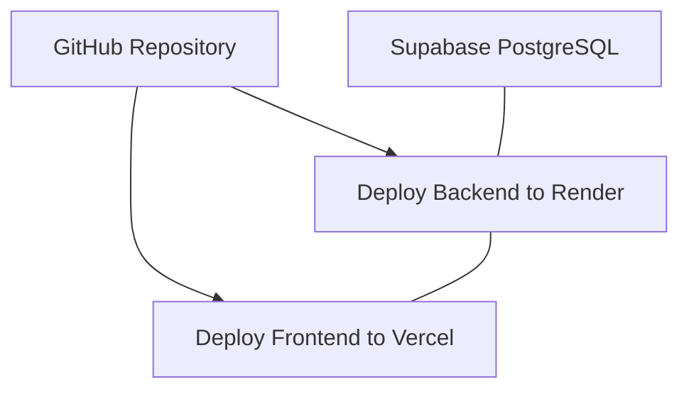

# 33 - Deployment Guide

## Table of Contents
1. [Deployment Architecture & Prerequisites](#1-deployment-architecture--prerequisites)
2. [Step 1: Supabase Database Provisioning](#2-step-1-supabase-database-provisioning)
3. [Step 2: Render Backend Web Service Deployment](#3-step-2-render-backend-web-service-deployment)
4. [Step 3: Vercel Frontend SPA Deployment](#4-step-3-vercel-frontend-spa-deployment)
5. [Environment Variables Matrix](#5-environment-variables-matrix)
6. [Post-Deployment Smoke Verification](#6-post-deployment-smoke-verification)
7. [Rollback & Emergency Recovery Protocol](#7-rollback--emergency-recovery-protocol)

---

## 1. Deployment Architecture & Prerequisites

**LeadDesk AI CRM** deploys cleanly across three specialized cloud platforms:

---

## 2. Step 1: Supabase Database Provisioning

1. Log into [Supabase Dashboard](https://supabase.com) and create a new project `leaddesk-ai-crm-prod`.
2. Open the SQL Editor in Supabase.
3. Paste and execute the SQL DDL migration script from [09-Database-Design.md](file:///C:/Users/PC/.gemini/antigravity/scratch/leaddesk-ai-crm/docs/09-Database-Design.md).
4. Copy the Project URL and Database Connection URI for step 2.

---

## 3. Step 2: Render Backend Web Service Deployment

1. Log into [Render Dashboard](https://render.com) and select **New Web Service**.
2. Connect your GitHub repository and select `/backend` as the Root Directory.
3. Set Build Command: `npm install`
4. Set Start Command: `node server.js`
5. Inject Environment Variables:
   * `PORT`: `5000`
   * `NODE_ENV`: `production`
   * `JWT_SECRET`: `<SECURE_HIGH_ENTROPY_RANDOM_STRING>`
   * `SUPABASE_URL`: `https://your-project.supabase.co`
   * `SUPABASE_ANON_KEY`: `<YOUR_SUPABASE_ANON_KEY>`
   * `CORS_ORIGIN`: `https://leaddesk-crm.vercel.app`
6. Click **Create Web Service**.

---

## 4. Step 3: Vercel Frontend SPA Deployment

1. Log into [Vercel Dashboard](https://vercel.com) and click **Add New Project**.
2. Select repository and set Root Directory to `/frontend`.
3. Set Framework Preset: `Vite`.
4. Inject Environment Variables:
   * `VITE_API_BASE_URL`: `https://leaddesk-backend.onrender.com/api/v1`
5. Click **Deploy**.

---

## 5. Environment Variables Matrix

| Variable Name | Environment | Sensitive | Example Value |
| :--- | :--- | :--- | :--- |
| `NODE_ENV` | Backend | No | `production` |
| `JWT_SECRET` | Backend | **Yes** | `c89a7f...21b9` |
| `SUPABASE_URL` | Backend | No | `https://xyz.supabase.co` |
| `SUPABASE_ANON_KEY` | Backend | **Yes** | `eyJhbGci...` |
| `VITE_API_BASE_URL` | Frontend | No | `https://api.leaddesk.com/api/v1` |

---

## 6. Post-Deployment Smoke Verification

1. Access public landing page: `https://leaddesk-crm.vercel.app`.
2. Submit test lead and verify green success toast appears.
3. Access `/login`, sign in as admin user, and verify lead appears in dashboard table with correct AI score.

---

## 7. Rollback & Emergency Recovery Protocol

* **Frontend Rollback**: Instant single-click deployment rollback via Vercel deployments menu.
* **Backend Rollback**: Redeploy previous successful Git commit SHA from Render dashboard.

---

## Cross-References
* System Architecture: [07-System-Architecture.md](file:///C:/Users/PC/.gemini/antigravity/scratch/leaddesk-ai-crm/docs/07-System-Architecture.md)
* Deployment Architecture: [14-Deployment-Architecture.md](file:///C:/Users/PC/.gemini/antigravity/scratch/leaddesk-ai-crm/docs/14-Deployment-Architecture.md)
* Implementation Plan: [31-Implementation-Plan.md](file:///C:/Users/PC/.gemini/antigravity/scratch/leaddesk-ai-crm/docs/31-Implementation-Plan.md)
