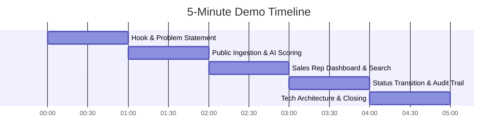

# 36 - Demo Strategy

## Table of Contents
1. [5-Minute Hackathon / Pitch Presentation Blueprint](#1-5-minute-hackathon--pitch-presentation-blueprint)
2. [Minute-by-Minute Script & Action Timeline](#2-minute-by-minute-script--action-timeline)
3. [Key Architecture Features to Highlight](#3-key-architecture-features-to-highlight)
4. [Live Interaction Flow & Data Ingestion Setup](#4-live-interaction-flow--data-ingestion-setup)
5. [Contingency Plan for Technical Failure](#5-contingency-plan-for-technical-failure)

---

## 1. 5-Minute Hackathon / Pitch Presentation Blueprint

This document specifies the exact timed script, screen transitions, narrative hook, and live interactive steps for presenting **LeadDesk AI CRM** to judges, clients, or executive stakeholders in a 5-minute demonstration.

---

## 2. Minute-by-Minute Script & Action Timeline

### Timeline & Speaker Script:

#### **0:00 – 1:00 | The Hook & Problem Statement**
* **Screen**: Slide showing 12-hour response latency vs. 2-minute target.
* **Speaker**: *"Enterprise marketing teams spend millions generating inbound leads, but 70% of buyer intent dies in slow, cluttered CRMs. Today we present LeadDesk AI CRM — the high-speed, intelligent lead processing engine."*

#### **1:00 – 2:00 | Public Ingestion & Live AI Scoring**
* **Screen**: Public Lead Capture Landing Page (`/`).
* **Speaker**: *"Watch live as I enter an enterprise lead payload with a $75,000 budget and custom domain. When I click Submit..."*
* **Action**: Click Submit. Show sub-100ms response confirmation.

#### **2:00 – 3:00 | Sales Rep Dashboard & Real-Time Search**
* **Screen**: Log into Sales Rep Dashboard (`/dashboard`).
* **Speaker**: *"Instantly, our React 19 UI renders the lead. Notice the score tier badge — automatically calculated as 'Hot' with a score of 90 based on intent signals."*
* **Action**: Filter search bar by "Acme" — show instant sub-50ms table filter update.

#### **3:00 – 4:00 | Single-Click Status Transition & Audit Logging**
* **Screen**: Lead Detail Modal.
* **Speaker**: *"The sales rep updates the status from 'New' to 'Contacted'. The UI updates optimistically, and behind the scenes, Supabase PostgreSQL immutably logs the audit event with actor ID and timestamp."*
* **Action**: Change status dropdown, show green success toast.

#### **4:00 – 5:00 | Tech Architecture, Security & Closing**
* **Screen**: Architecture Overview Slide (Express + Supabase + React 19).
* **Speaker**: *"Built on React 19, Express.js, and Supabase PostgreSQL with full JWT security and OWASP hardening. LeadDesk AI CRM turns chaotic lead traffic into revenue. Thank you!"*

---

## 3. Key Architecture Features to Highlight

1. **Sub-100ms Ingestion SLA**: Emphasize speed of backend Express handling.
2. **Deterministic AI Intent Engine**: Explain rule-based scoring without expensive external latency.
3. **Immutability & Governance**: Show the audit trail ensuring compliance.

---

## 4. Live Interaction Flow & Data Ingestion Setup

* **Pre-seeded Data**: Seed 50 realistic B2B lead records beforehand so table filter demo is visually rich.
* **Form Automation**: Pre-fill form using auto-fill helper for smooth presentation.

---

## 5. Contingency Plan for Technical Failure

* **Plan A**: Live production site on Vercel + Render.
* **Plan B (Backup)**: Local host fallback (`localhost:5173`).
* **Plan C (Emergency)**: High-resolution video recording of full end-to-end flow.

---

## Cross-References
* PRD Specifications: [04-Product-Requirements-Document.md](file:///C:/Users/PC/.gemini/antigravity/scratch/leaddesk-ai-crm/docs/04-Product-Requirements-Document.md)
* System Architecture: [07-System-Architecture.md](file:///C:/Users/PC/.gemini/antigravity/scratch/leaddesk-ai-crm/docs/07-System-Architecture.md)
* Judge Q&A: [37-Judge-QA.md](file:///C:/Users/PC/.gemini/antigravity/scratch/leaddesk-ai-crm/docs/37-Judge-QA.md)
